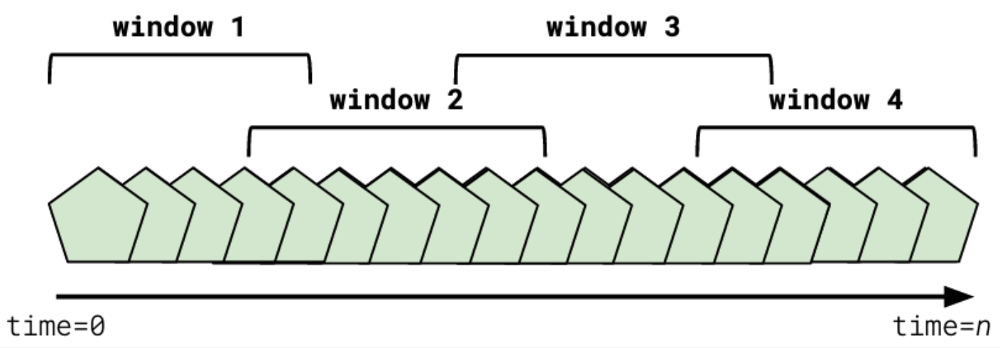
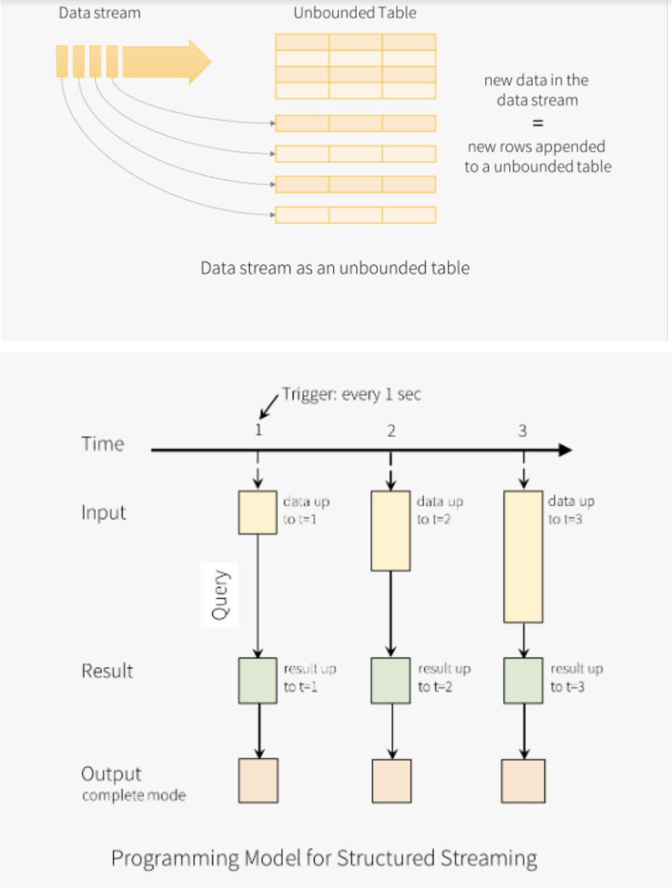
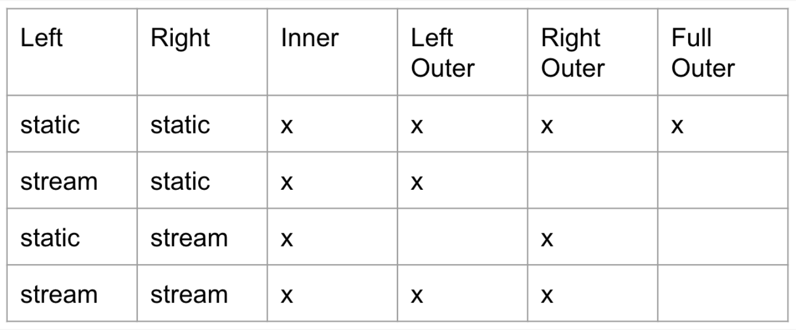
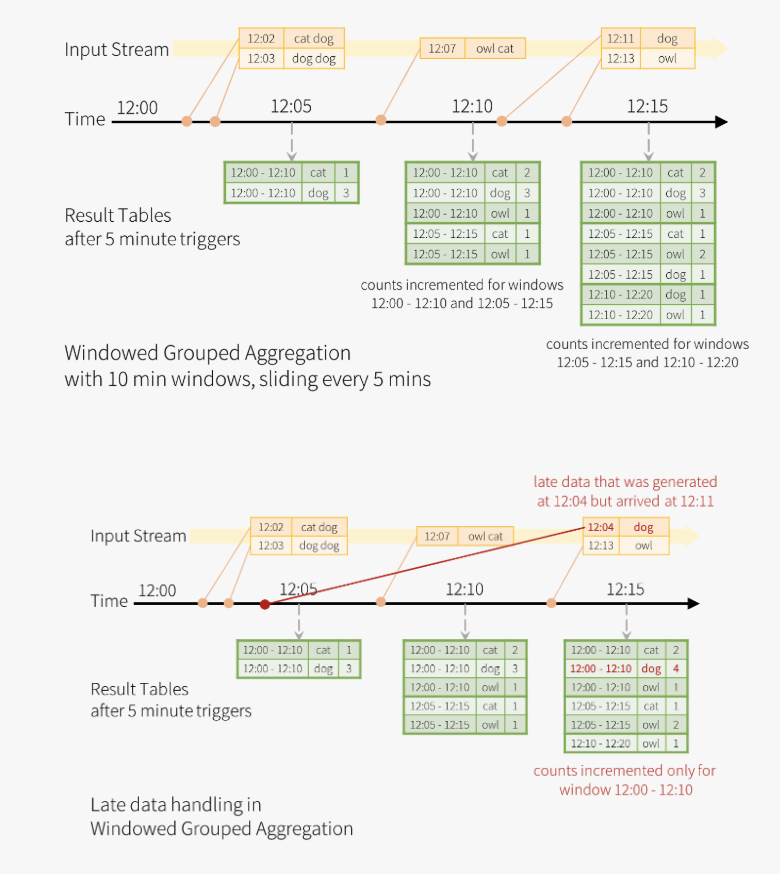
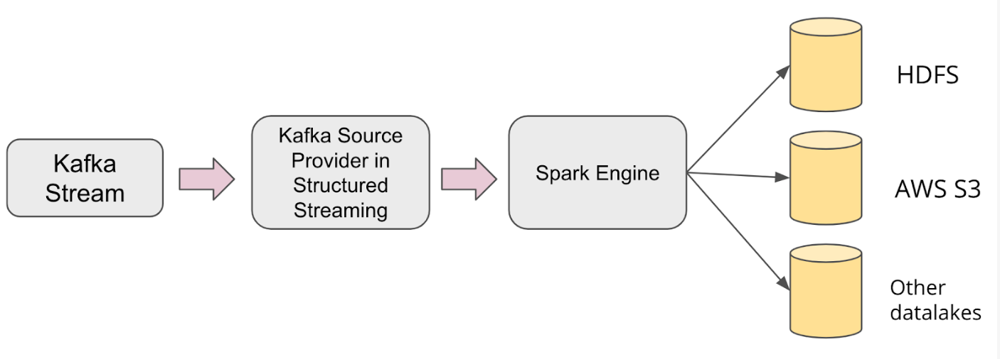
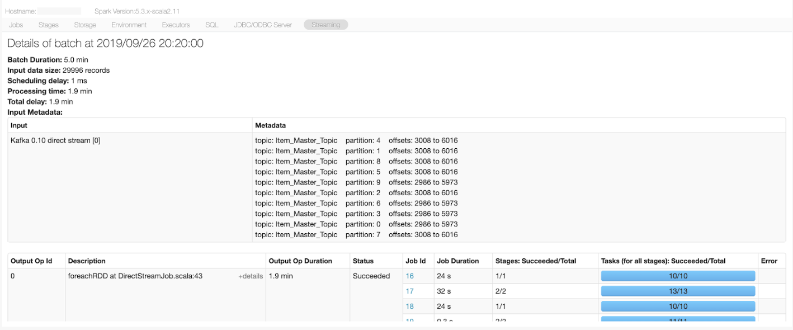
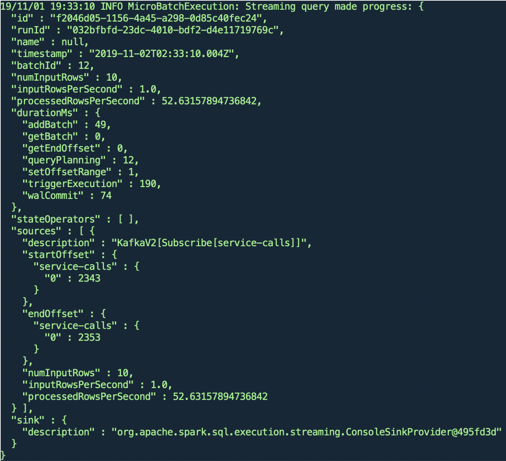

# Data Streaming Udacity

## Timely decisions
- Data loses value quickly over time
- Real time analysis are way more productive
![time_value_data]

## Understanding Stream Processing
In computing, a stream is typically thought of as a potentially unbounded sequence.

Stream Processing is the act of performing continual calculations on a potentially endless and constantly evolving source of data.

Stream Processing applications perform calculations on Data Streams. Data Streams consist of a potentially endless stream of immutable data.

Immutable data does not change -- once the data has been placed in the data stream it can never be updated. Another data entry can be placed in the stream that supersedes the previous data entry if necessary.

Data sent to data streams is typically small, less than 1MB in size.

The data throughput to data streams is highly variable. Some streams will receive thousands or tens of thousands of records per second, and some will receive one or two records per hour.

- Stream Processing acts on potentially endless and constantly evolving immutable data contained in data streams.
- Once data have been placed in a data stream, they cannot be modified. We must place a new record in the stream to override the existing data.
- Finally, data in data streams is typically less than 1MB in size and the data volume may vary from a few records an hour to thousands of requests per second.
- Stream processing allows companies to process data as it's generated and not hours after the fact as is common with batch processing.

### What is an event
- An immutable fact regarding something that occured within our software system

## Example of usages
- Log analysis - New Relic Example - APM, Failure Prediction and Debugging. How to process huge amount of data.
- Web Analytics - Mix Panel - Track user actions, clicks page views.
- Right sharing application - Real Time Pricing - Adjusts to environmental factors and instantaneous demand. (Real time ML and model pricing recommendation) Pricing according to demand, supply, events (soccer), weather, etc.
- Financial Analysis - Finance, tweets, news, etc.
- Finding patterns and meaningful data in disparate log messages in a microservices architecture
- Tracking user-engagement in real time with streaming website analytics
- Real-time pricing in ride-sharing applications based on demand and environmental conditions
- Stock buying/selling based on price, news, and social media sentiment

### Batch Processing
- Runs on a scheduled basis
- May run for a longer period of time and write results to a SQL-like store
- May analyze all historical data at once
- Typically works with mutable data and data stores

### Stream Processing
- Runs at whatever frequency events are generated
- Typically runs quickly, updating in-memory aggregates
- Stream Processing applications may simply emit events themselves, rather than write to an event store
- Typically analyzes trends over a limited period of time due to data volume
- Typically analyzes immutable data and data stores

**Batch and Stream processing are not mutually exclusive. Batch systems can create events to feed into stream processing applications, and similarly, stream processing applications can be part of batch processing analyses.**

## Components of a Stream Processing Solution

### Streaming Data Store
- May look like a message queue, as is the case with Apache Kafka
- May look like a SQL store, as is the case with Apache Cassandra
- Responsible for holding all of the immutable event data in the system
- Provides guarantee that data is stored ordered according to the time it was produced
- Provides guarantee that data is produced to consumers in the order it was received
- Provides guarantee that the events it stores are immutable and unchangeable

### Stream Processing Application and Framework
- Stream Processing applications sit downstream of the data store
- Stream Processing applications ingest real-time event data from one or more data streams
- Stream Processing applications aggregate, join, and find differences in data from these streams
- Common Stream Processing Application Frameworks in use today include:
  - Confluent KSQL
  - Kafka Streams
  - Apache Flink
  - Apache Samza
  - Apache Spark Structure Streaming
  - Faust Python Library

### Further Optional Reading on Message Queues
- [RabbitMQ](https://www.rabbitmq.com/)
- [ActiveMQ](https://activemq.apache.org/)

## Benefits of Stream Processing
- *Good Aplications focus on event generation, rather than data flow o r something similar. This is done to isolate and be agnostic on what is going to be done.*
- Faster for scenarios where a limited set of recent data is needed
- More scalable due to distributed nature of storage
- Provides a useful abstraction that decouples applications from each other
- Allows one set of data to satisfy many use-cases which may not have been predictable when the dataset was originally created
- Built-in ability to replay events and observe exactly what occurred, and in what order, provides more opportunities to recover from error states or dig into how a particular result was arrived at

## Glosary
- **Stream** - An unbounded sequence of ordered, immutable data
- **Stream Processing** - Continual calculations performed on one or more Streams
- **Immutable Data** - Data that cannot be changed once it has been created
- **Event** - An immutable fact regarding something that has occurred in our system.
- **Batch Processing** - Scheduled, periodic analysis of one or more groups of related data.
- **Data Store** - A generic place that holds data of some kind, like a message queue or data store
- **Stream Processing Application** - An application which is downstream of one or more data streams and performs some kind of calculation on incoming data, typically producing one or more output data streams
- **Stream Processing Framework** - A set of tools, typically bundled as a library, used to construct a Stream Processing Application
- **Real-time** - In relation to processing, this implies that a piece of data, or an event, is processed almost as soon as it is produced. Strict time-based definitions of real-time are controversial in the industry and vary widely between applications. For example, a Computer Vision application may consider real-time to be 1 millisecond or less, whereas a data engineering team may consider it to be 30 seconds or less. In this class when the term "real-time" is used, the time-frame we have in mind is seconds.
- **Append-only Log** - files in which incoming events are written to the end of the file as they are received
- **Change Data Capture (CDC)** - The process of capturing change events, typically in SQL database systems, in order to accurately communicate and synchronize changes from primary to replica nodes in a clustered system.
- **Log-Structured Storage** - Systems built on Append-Only Logs, in which system data is stored in log format.
- **Merge (Log Files)** - When two or more log files are joined together into a single output log file
- **Compact (Log Files)** - When data from one or more files is deleted, typically based on the age of data
- **Source (Kafka)** - A term sometimes used to refer to Kafka clients which are producing data into Kafka, typically in reference to another data store
- **Sink (Kafka)** - A term sometimes used to refer to Kafka clients which are extracting data from Kafka, typically in reference to another data store
- **Topic (Kafka)** - A logical construct used to organize and segment datasets within Kafka, similar to how SQL databases use tables
- **Producer (Kafka)** - An application which is sending data to one or more Kafka Topics.
- **Consumer (Kafka)** - An application which is receiving data from one or more Kafka Topics.

## Key concepts to remember about stream processing
- Stream processing applications consist of a stream data store and a stream processing application framework
- Stream processing solutions do not operate on a scheduled basis
- Stream processing solutions provide real-time insights based on event data
- Stream processing solutions are built around generic data events, allowing for flexibility in data processing and highly scalable applications
- Batch and stream processing solutions can coexist and feed into each other

## Data Streams are Append-Only Logs
### Append-only logs
- Append-only logs are text files in which incoming events are written to the end of the log as they are received.
- This simple concept -- of only ever appending, or adding, data to the end of a log file -- is what allows stream processing applications to ensure that events are ordered correctly even at high throughput and scale.
- We can take this idea a step farther, and say that in fact, streams are append-only logs.

### Log-structured streaming
- Log-structured streams build upon the concept of append-only logs. One of the hallmarks of log-structured storage systems is that at their core they utilize append-only logs.
- Common characteristics of all log-structured storage systems are that they simply append data to log files on disk.
- These log files may store data indefinitely, for a specific time period, or until a specific size is reached.
- There are typically many log files on disk, and these log files are merged and compacted occasionally.
- When a log file is merged it means that two or more log files are joined together into one log file.
- When a log file is compacted it means that data from one or more files is deleted. Deletion is typically determined by the age of a record. The oldest records are removed, while the newest stay.
- Examples of real world log-structured data stores: [Apache HBase](https://hbase.apache.org/), [Apache Cassandra](http://cassandra.apache.org/), [Apache Kafka](https://kafka.apache.org/)

### Log-Structured Storage
One of the key innovations over the past decade in computing has been the emergence of log-structured storage as a primary means of storing data.

# Kafka: A Stream Processing Tool
## Apache Kafka as a Stream Processing Tool
- Kafka is one of the most popular streaming data platforms in the industry today.
- Provides an easy-to-use message queue interface on top of its append-only log-structured storage medium
- Kafka is a log of events
- In Kafka, an event describes something that has occurred, as opposed to a request for an action to be performed
- Kafka is distributed by default
- Fault tolerant by design, meaning it is hard to lose data if a node is suddenly lost
- Kafka scales from 1 to thousands of nodes
- Kafka provides ordering guarantees for data stored within it, meaning that the order in which data is received is the order in which data will be produced to consumers
- Commonly used data store for popular streaming tools like Apache Spark, Flink, and Samza

### Kafka History
- Created at Linkedin to service internal stream processing needs
- Kafka is one of the Apache Foundation’s most popular projects
- Used widely in production. Some famous users include Uber, Apple, and Airbnb
- Creators of Kafka left LinkedIn to found Confluent, which now acts as the owner and leader of the Kafka project
- Jay Kreps, one of the core authors of Apache Kafka, named the system after Czech author Franz Kafka. Kreps, who enjoys Kafka’s work, thought the name was a good fit because Kafka was built to be a “system optimized for writing.”

### Kafka in Industry
- The term source is sometimes used to refer to Kafka clients which are producing data into Kafka, typically in reference to another data store
- The term sink is sometimes used to refer to Kafka clients which are extracting data from Kafka, typically in reference to another data store

How Uber uses Kafka:
- [The Uber Engineering Tech Stack Part 1](https://eng.uber.com/tech-stack-part-one/)
- [The Uber Engineering Tech Stack Part 2](https://eng.uber.com/tech-stack-part-one/)

# Kafka in Action

## Kafka Topics
- Used to organize and segment datasets, similar to SQL database tables
- Unlike SQL database tables, Kafka Topics are not queryable.
- May be created programmatically, from a CLI (Command Line Interface), or automatically
- Consist of key-value data in binary format

## Kafka Producers
- Send event data into Kafka topics
- Integrate with client libraries in languages like Java, Python, Go, as well as many other languages

## Kafka Consumers
- Pull event data from one or more Kafka Topics
- Integrate with Kafka via a Client Library written in languages like Python, Java, Go, and more
- By default only consume data that was produced after the consumer first connected to the topic. Historical data will not be consumed by default.

# Kafka CLI

## Commands:
- `kafka-topics`: Create delete describe or change a topic
  - `--create`: Create topic
  - `--delete`: 
  - `--describe`
  - `--list`
  - `--zookeeper`: **REQUIRED** Keeps configuration for the Kafka Cluster
  - `--partitions`:
  - `--replication-factor`:
  - `--alter`: Alter the number of partition of a topic
- `kafka-console-producer`: Connects to a data broker. Then you can send messages
  - `broker-list`: **REQUIRED** The Broker list string Ex: localhost:9092 (URL of Kafka Broker different from zookeeper)
  - `topic`: **REQUIRED** Topic id to produce messages to
- `kafka-console-consumer`: Connects to a data broker. By default would only read messages produced after it was created.
  - `topic`: **REQUIRED** Topic id to consume
  - `--bootstrap-server`: **REQUIRED** The broker list string. Ex: localhost:9092 (URL of Kafka Broker different from zookeeper). Also could be: PLAINTEXT://localhost:9092
  - `--from-beginning`: Would get all the messages from a topic

## Kafka in Action - Summary
- A Kafka Topic is how Kafka organizes and segments datasets
- A Kafka Producer is an application that emits event data into a Kafka Topic
- A Kafka Consumer is an application that pulls event data from one or more Kafka Topics
- How to use the Kafka CLI Tools, such as ``kafka-topics``, ``kafka-console-producer``, and ``kafka-console-consumer``
- How to use the ``confluent-kafka-python`` library to create a topic, producer, and consumer


# Lesson 2 - Apache Kafka in depth

## Glossary
- **Broker (Kafka)** - A single member server of the Kafka cluster
- **Cluster (Kafka)** - A group of one or more Kafka Brokers working together to satisfy Kafka production and consumption
- **Node** - A single computing instance. May be physical, as in a server in a datacenter, or virtual, as an instance might be in AWS, GCP, or Azure.
- **Zookeeper** - Used by Kafka Brokers to determine which broker is the leader of a given partition and topic, as well as track cluster membership and configuration for Kafka
- **Access Control List (ACL)** - Permissions associated with an object. In Kafka, this typically refers to a user’s permissions with respect to production and consumption, and/or the topics themselves.
- **JVM - The Java Virtual Machine** - Responsible for allowing host computers to execute the byte-code compiled against the JVM.
- **Data Partition (Kafka)** - Kafka topics consist of one or more partitions. A partition is a log which provides ordering guarantees for all of the data contained within it. Partitions are chosen by hashing key values.
- **Data Replication (Kafka)** - A mechanism by which data is written to more than one broker to ensure that if a single broker is lost, a replicated copy of the data is available.
- **In-Sync Replica (ISR)** - A broker which is up to date with the leader for a particular broker for all of the messages in the current topic. This number may be less than the replication factor for a topic.
- **Rebalance** - A process in which the current set of consumers changes (addition or removal of consumer). When this occurs, assignment of partitions to the various consumers in a consumer group must be changed.
- **Data Expiration** - A process in which data is removed from a Topic log, determined by data retention policies.
- **Data Retention** - Policies that determine how long data should be kept. Configured by time or size.
- **Batch Size** - The number of messages that are sent or received from Kafka
- **acks** - The number of broker acknowledgements that must be received from Kafka before a producer continues processing
- **Synchronous Production** - Producers which send a message and wait for a response before performing additional processing
- **Asynchronous Production** - Producers which send a message and do not wait for a response before performing additional processing
- **Avro** - A binary message serialization format
- **Message Serialization** - The process of transforming an applications internal data representation to a format suitable for interprocess communication over a protocol like TCP or HTTP.
- **Message Deserialization** - The process of transforming an incoming set of data from a form suitable for interprocess communication, into a data representation more suitable for the application receiving the data.
- **Retries (Kafka Producer)** - The number of times the underlying library will attempt to deliver data before moving on
- **Consumer Offset** - A value indicating the last seen and processed message of a given consumer, by ID.
- **Consumer Group** - A collection of one or more consumers, identified by group.id which collaborate to consume data from Kafka and share a consumer offset.
- **Consumer Group Coordinator** - The broker in charge of working with the Consumer Group Leader to initiate a rebalance
- **Consumer Group Leader** - The consumer in charge of working with the Group Coordinator to manage the consumer group
- **Topic Subscription** - Kafka consumers indicate to the Kafka Cluster that they would like to consume from one or more topics by specifying one or more topics that they wish to subscribe to.
- **Consumer Lag** - The difference between the offset of a consumer group and the latest message offset in Kafka itself
- **CCPA** - California Consumer Privacy Act
- **GDPR** - General Data Protection Regulation

## Kafka Architecture
- Kafka servers are referred to as brokers
- All of the brokers that work together are referred to as a cluster
- Clusters may consist of just one broker, or thousands of brokers
- Apache Zookeeper is used by Kafka brokers to determine which broker is the leader of a given partition and topic
- Zookeeper keeps track of which brokers are part of the Kafka cluster
- Zookeeper stores configuration for topics and permissions (Access Control Lists - ACLs)
- ACLs are Permissions associated with an object. In Kafka, this typically refers to a user’s permissions with respect to production and consumption, and/or the topics themselves.
- Kafka nodes may gracefully join and leave the cluster
- Kafka runs on the Java Virtual Machine (JVM)

## Kafka Clustering
- Kafka servers are referred to as brokers and organized into clusters.
- Kafka uses Apache Zookeeper to keep track of topic and ACL(Permission) configuration, as well as determine leadership and cluster management.
- Usage of ZooKeeper means that Kafka brokers can typically seamlessly join and leave clusters, allowing Kafka to grow easily as its usage increases or decreases.
- Kafka stores data according to the topic as multiple text log files
- Kafka partitions (Higlighted are leaders of a partition) it has some replications
![kafka-partitions]
**Partitions Takeaways**
- Partitions are unit of parallelism
- Consumers may parallelize data from each partition
- Producers may paralelize data from each partition
- Partition assignment is done by hashing to distribute them evenly
- Reduces bottlenecks by involving multiple brokers

### Data Replication
- Data written in many brokers
- Partition leaders are the ones who handles petitions or requests, when a leader fails another broker is selected to be the leader
- Can't have more replicas than you have brokers
- Data replication incurs overhead
- Always enable replication if you can in a Production Cluster

### How Kafka Works - Summary
- A Kafka Broker is an individual Kafka server
- A Kafka Cluster is a group of Kafka Brokers
- Kafka uses Zookeeper to elect topic leaders and store its own configuration
- Kafka writes log files to disk on the Kafka brokers themselves
- How Kafka achieves scale and parallelism with topic partitions
- How Kafka provides resiliency and helps prevent data loss with data replication

## Kafka Topic in Depth
Kafka Topics are rich in configuration options. To get the most out of Kafka you will need to develop a strong understanding of how these options impact performance. This will include understanding how to replicate topics in Kafka.

### Topic configuration
- Data replication can be set on a per-topic basis
- A broker must be an "In Sync Replica" (ISR) to become leader
- Desired number of ISRs can be set on topics

### Partitioning Topics Tips and Equation
- The “right” number of partitions is highly dependent on the scenario.
- The most important number to understand is desired throughput. How many MB/s do you need to achieve to hit your goal?
- You can easily add partitions at a later date by modifying a topic.
- Partitions have performance consequences. They require additional networking latency and potential rebalances, leading to unavailability.
- Determine the number of partitions you need by dividing the overall throughput you want by the throughput per single consumer partition or the throughput per single producer partition. Pick the larger of these two numbers to determine the needed number of partitions.
  - ``# Partitions = Max(Overall Throughput/Producer Throughput, Overall Throughput/Consumer Throughput)``
  - Example from video, with 3 Producers and 5 Consumers, each operating at 10MB/s per single producer/consumer partition: Max(100MBs/(3 * 10MB/s), 100MBs/(5 * 10MB/s)) = Max(2) ~= *4 partitions needed*
- [Considerations in choosing the number of partitions](https://www.confluent.io/blog/how-choose-number-topics-partitions-kafka-cluster)
![topic_ordering]

### Naming Conventions
- No official or idiomatic pattern defined
- Kafka requires names <256 chars, [a-zA-Z0-9.-_]
- Name topics according to some consistent strategy
- Consistent naming leads to simpler consumption
- Naming conventions can help reduce confusion, save time, and even increase reusability.
- Recommendation:
<domain>.<model>.<event_type>
Ex: com.udacity.data_stream.lesson2.quiz.result
The important thing is to be consistent across all topics

### Data Management
- Data retention determines how long Kafka stores data in a topic.
  - [The retention.bytes, retention.ms settings control retention policy](https://kafka.apache.org/documentation.html#topicconfigs)
- When data expires it is deleted from the topic.
  - [This is true if cleanup.policy is set to delete](https://kafka.apache.org/documentation.html#topicconfigs)
- Retention policies may be time based. Once data reaches a certain age it is deleted.
  - [The retention.ms setting controls retention policy on time](https://kafka.apache.org/documentation.html#topicconfigs)
- Retention policies may be size based. Once a topic reaches a certain age the oldest data is deleted.
  - [The retention.bytes setting controls retention policy on time](https://kafka.apache.org/documentation.html#topicconfigs)
- Retention policies may be both time- and size-based. Once either condition is reached, the oldest data is deleted.
- Alternatively, topics can be compacted in which there is no size or time limit for data in the topic.
  - [This is true if cleanup.policy is set to compact](https://kafka.apache.org/documentation.html#topicconfigs)
- Compacted topics use the message key to identify messages uniquely. If a duplicate key is found, the latest value for that key is kept, and the old message is deleted.
- Kafka topics can use compression algorithms to store data. This can reduce network overhead and save space on brokers. Supported compression algorithms include: lz4, ztsd, snappy, and gzip.
  - [compression.type controls the type of message compression for a topic](https://kafka.apache.org/documentation.html#topicconfigs)
- Kafka topics should store data for **ONE type of event**, not multiple types of events. Keeping multiple event types in one topic will cause your topic to be hard to use for downstream consumers.

### Topic Creation
- **DO NOT CREATE AUTOMATIC TOPICS**
- Create them manually with the things as needed
- Write code to check if the desired topic exists
- Use bash scripts o terraform to create your topics.
#### Example:
```python
config={
  "cleanup.policy": "compact", # What to do with old logs. Delete old topics. Other option is compact
  "compression.type": "lz4", # Compression type for topics
  "delete.retention.ms": 100, # Marked for deletion how mucho to wait to delete
  "file.delete.delay.ms": 100, # Time to wait for delteing file in filesystem
  ...
}
```
### Optional Further Research in Kafka Topics
- [Kafka topic settings documentation](https://kafka.apache.org/documentation.html#topicconfigs)
- [Confluent blog post on Partitioning](https://www.confluent.io/blog/how-choose-number-topics-partitions-kafka-cluster)

### Kafka Producers
- Synchronously and asynchronously send data to Kafka
- Use key configuration options, such as batch size, client identifiers, compression, and acknowledgements
- Specify data serializers

#### Synchronous Producer
- Blocks producer program until the broker has confirmed receipt
- Make sure data was succefully delivered
- Not common usage

#### Asynchronous Producer
- Maximizes throughput
- Most common usage
- Use callbacks to know when an error occured

#### Message Serialization
- Data sent to Kafka should be serialized into a format
- Kafka client can assist serialization
- Formats include binary, string, csv, json, avro.
- **Never change serialization type without a new topic**

#### Producer Summary Configuration
- All available settings for the `confluent_kafka_python` library can be found in the [librdkafka](https://github.com/edenhill/librdkafka/blob/master/CONFIGURATION.md) configuration options. `confluent_kafka_python` uses `librdkafka` under the hood and shares the exact configuration options in this document.
- It is a good idea to always set the `client.id` for improved logging, debugging, and resource limiting
- The `retries` setting determines how many times the producer will attempt to send a message before marking it as failed
- If ordering guarantees are important to your application and you’ve also enabled retries, make sure that you set `enable.idempotence` to true
- Producers may choose to compress messages with the ``compression.type`` setting
Options are none, `gzip`, `lz4`, `snappy`, and `zstd`
Compression is performed by the producer client if enabled
- If the topic has its own compression setting, it must match the producer setting, otherwise the broker will decompress and recompress the message into its configured format.
- The `acks` setting determines how many In-Sync Replica (ISR) Brokers need to have successfully received the message from the client before moving on
- A setting of `-1` or `all` means that all ISRs will have successfully received the message before the producer proceeds
- Clients may opt to set this to 0 for performance reasons
- The diagram below illustrates how the topic and producer may have different compression settings. However, the setting at the topic level will always be what the consumer sees. ![diagram_compression]

#### Batching Configuration
- A producer doesn't send all data inmediately, batches all data generated according to some conditions.
- Messages may be batched on one or more of: time, count or size
- Kafka clients allow configuration of these batch settings
- Batch settings can be critical for producer performance

**Set configuration carefully on the producer, particullarly on the buffer side**

#### Kafka Producers - Summary
Kafka Producers are rich in options and configuration. In this section you’ve seen how to adapt your producer code to a wide-variety of real world situations through configuration.

Remember, no one set of settings works in all scenarios. If your producer application isn’t performing the way you expect, it’s worth revisiting your producer configuration to ensure that the settings make sense for the throughput level you are hoping to achieve.

#### Optional Further Reading on Kafka Producers
- `confluent-kafka-python`/`librdkafka` [Configuration Options](https://github.com/edenhill/librdkafka/blob/master/CONFIGURATION.md)
- [Apache Documentation on Producer Configuration](https://kafka.apache.org/documentation/#producerconfigs)
- `confluent-kafka-python` [Producer class](https://docs.confluent.io/current/clients/confluent-kafka-python/index.html?highlight=serializer#producer)

### Kafka Consumers

**Key Points**
- `client.id` is an optional setting which is useful in debugging and resource limiting
- Poll for data to read data from Kafka
  - poll
  - consume
- Consumrs subscribe to one or more topics
- Subscribing to a topic that does not exists will create it with default settings (Not recommended)

#### Consumer Offsets - Key Points
- Kafka keeps track of what data a consumer has seen with offsets
  - Kafka stores offsets in a private internal topic
  - Most client libraries automatically send offsets to Kafka for you on a periodic basis
  - You may opt to commit offsets yourself, but it is not recommended unless there is a specific use-case.
  - Offsets may be sent synchronously or asynchronously (Recommended asynchronously)
  - Committed offsets determine where the consumer will start up
    - If you want the consumer to start from the first known message, [set auto.offset.reset to earliest]
    - This will only work the first time you start your consumer. On subsequent restarts it will pick up wherever it left off
    - If you always want your consumer to start from the earliest known message, you must manually assign your consumer to the start of the topic on boot

#### Example:
- `auto.offset.reset`: How to connect to the topic, pick where it left or all messages, only works the first time a consumrs connects to a topic. You pick up were it left.
- `on_assign` Callback on suscribe can change offset assignment on partitions

#### Consumer Groups
A group id parameters must be set on consumers
- Consumer groups are clients consuming from the same topic
- A consumer of a consumer group can only see specific partitions
- **REBALANCE IS EXPENSIVE** The consumers enter to a halt/sleep state where they do not consume. Avoid unnecessary rebalancing.
- All Kafka Consumers belong to a Consumer group
- The group.id [parameter](https://docs.confluent.io/current/installation/configuration/consumer-configs.html#) is required and identifies the globally unique consumer group
- Consumer groups consist of one or more consumers
- Consumer groups increase throughput and processing speed by allowing many consumers of topic data. However, only one consumer in the consumer group receives any given message.
- If your application needs to inspect every message in a topic, create a consumer group with a single member
- Adding or removing consumers causes Kafka to rebalance
  - During a rebalance, a broker group coordinator identifies a consumer group leader
  - The consumer group leader reassigns partitions to the current consumer group members
  - During a rebalance, messages may not be processed or consumed

#### Consumer Subscriptions
- You subscribe to a topic by specifying its name
  - If you wanted to subscribe to com.udacity.lesson.views, you would simply specify the full name as ”com.udacity.lesson.views”
  - Make sure to set allow.auto.create.topics to false so that the topic isn’t created by the consumer if it does not yet exist
- One consumer can subscribe to multiple topics by using a regular expression
  - The format for the regular expression is slightly different. If you wanted to subscribe to com.udacity.lesson.views.lesson1 and com.udacity.lesson.views.lesson2 you would specify the topic name as ”^com.udacity.lesson.views.*”
  - The topic name must be prefixed with ”^” for the client to recognize that it is a regular expression, and not a specific topic name
  - Use regexp to specify your regular expressions.
  - See the [confluent_kafka_python `subscribe()`](https://docs.confluent.io/current/clients/confluent-kafka-python/index.html?highlight=serializer#confluent_kafka.Consumer.subscribe) documentation for more information

#### Deserializers
- Remember to deserialize the data you are receiving from Kafka in an appropriate format
  - If the producer used JSON, you will need to deserialize the data using a JSON library
  - If the producer used bytes or string data, you may not have to do anything
- Consumer groups increase fault tolerance and resiliency by automatically redistributing partition assignments if one or more members of the consumer group fail.

#### Retrieving Data From Kafka
The consumer poll loop fetches data from Kafka
- Most Kafka Consumers will have a “poll” loop which loops infinitely and ingests data from Kafka
- Here is a sample poll loop:
```python
while True:
  message = consumer.poll(timeout=1.0)
  # messages = consumer.consume(5, timeout=1.0) # 5 messages at a time returns batch of messages
  if message is None:
    print("no message received by consumer")
  elif message.error() is not None:
    print(f"error from consumer {message.error()}")
    # Log error
    continue
  else:
    print(f"consumed message {message.key()}: {message.value()}")
```
- It is possible to use either poll or consume, but poll is slightly more feature rich
- Make sure to call close() on your consumer before exiting and to consume any remaining messages
- Failure to call close means the Kafka Broker has to recognize that the consumer has left the consumer group, which takes time and failed messages. Try to avoid this if you can. This will cause a rebalance

#### Optional Further Research
- [Consumer Configuration Options](https://kafka.apache.org/documentation/#consumerconfigs)
- `confluent_kafka_python` [Options](https://docs.confluent.io/current/clients/confluent-kafka-python/index.html?highlight=serializer#consumer)
- `librdkafka` [consumer options shared with `confluent_kafka_python`](https://github.com/edenhill/librdkafka/blob/master/CONFIGURATION.md)

## Performance

### Metrics for consumer performance

#### Consumer
- **Consumer lag** measures how far behind consumer is: `Lag = Latest Topic Offset - Consumer Topic Offset`
  - Validate that the lag does not grow over time, consumer cant keep up
  - Will need aditional consumer processes
- Messages per second indicates throughput
- Kafka Java Metrics Explorer provides real-time metrics

#### Producer
- Measure latency to understand performance: `latency = time broker received - time produced`
  - Must be constant
  - Must be small
- High latency may indicate that your `acks` setting is too high and that too many `ISR` nodes must confirm message before returning
- High latency may indicate too many replicas
- **Producer response rate** tracks overall delivery rate (Messages delivered over time). Measure this number using producer delivery callbacks

#### Broker
- Track disc usage, high disk usage cause outages. It stores lots of data.
  - May cause data loss and high downtimes if not enough space
- Network usage may slow consume/produce
  - Avoid always network saturation
- Elections frequency. Should be infrequent
  - When Leadership elections occurs, it stops all consumers and producers. It is very disruptive
  - Frequent elections indicates broker instability (Cluster issues)

#### Summary
Monitoring Kafka Consumers, Producers, and Brokers for performance is an important part of using Kafka. There are many metrics by which to measure your Kafka cluster. Focus on these key metrics to get started:

- Consumer Lag: The difference between the latest offset in the topic and the most recently committed consumer offset
- Producer Response Rate: The rate at which the broker is responding to the producer indicating message status
- Producer Request Latency: The length of time a producer has to wait for a response from the broker after sending a message
- Broker Disk Space
- Broker Elections

### Further Research
- [DataDog blog post on monitoring Kafka](https://www.datadoghq.com/blog/monitoring-kafka-performance-metrics)
- [Confluent article on monitoring Kafka](https://docs.confluent.io/current/kafka/monitoring.html)
- [New Relic article on monitoring Kafka](https://blog.newrelic.com/engineering/new-relic-kafkapocalypse/)

## Data Privacy and Removing Records
Removing data from Kafka requires special planning and consideration, since it utilizes an append-only log. In this section you will learn about strategies and privacy regulations related to removing Kafka records.

- Message expiration, wait data after X time, or amount of data.
- Log compaction. Null messages in a compacted topic delete the data for that key.
  - Changing the value of a compacted topic into `null` wil cause all messages with that key to be dropped
  - Log compaction timing setting to be aware of
  - It may take to long for the data to be compacted and deleted
- User data may be spread through many topics and not always key on user_id

### Encrypted User Keys
- User data is encrypted with a special key per user
- The key is used to decrypt and access the data
- [Daniel Lebrero invented this way](https://danlebrero.com/2018/04/11/kafka-gdpr-event-sourcing/)
- Create a topic with an encryption key for every user, encrypt all other topic data for the user with that key
  
### Summary
- Privacy regulations like GDPR and CCPA are increasingly common and require applications to give users the right to be forgotten
- You can accomplish this with message expiration on topics that is of shorter duration than your requirement
- You may also use log compaction with null messages to delete data
- The best approach is to use [Daniel Lebrero’s Encrypted User Keys strategy](https://danlebrero.com/2018/04/11/kafka-gdpr-event-sourcing/)

### Further reading
- [Confluent blog post on GDPR and the right to be forgotten](https://www.confluent.io/blog/handling-gdpr-log-forget/)
- [Daniel Lebrero’s Encrypted User Keys strategy](https://danlebrero.com/2018/04/11/kafka-gdpr-event-sourcing/)


# Data Schemas
This section introduces the concept of data schemas and why they are a critical part of real world stream processing applications.

## What are Data Schemas
- Data schemas help us define:
  - The shape of the data
  - The names of fields
  - The expected types of values
  - Whether certain data fields are optional or required.
- Data schemas provide expectations for applications so that they can properly ingest or produce data that match that specification
- Data schemas are used for communication between software
- Data schemas can help us create more efficient representations with compression
- Data schemas help systems develop independently of each other
- Data schemas are critical in data systems and applications today
  - gRPC in Kubernetes
    - Protocol buffer schema languaga
  - Apache Avro in the Hadoop Ecosystem

## Glossary
- Data Schema - Define the shape of a particular kind of data. Specifically, data schemas define the expected fields, their names, and value types for those fields. Data schemas may also indicate whether fields are required or optional.
- Apache Avro - A data serialization framework which includes facilities for defining and communicating data schemas. Avro is widely used in the Kafka ecosystem and data engineering generally.
- Record (Avro) - A single encoded record in the defined Avro format
- Primitive Type (Avro) - In Avro, a primitive type is a type which requires no additional specification - null, boolean, int, long, float, double, bytes, string.
- Complex Type (Avro) - In Avro, a complex type models data structures which may involve nesting or other advanced functionality: records, enums, maps, arrays, unions, fixed.
- Schema Evolution - The process of modifying an existing schema with new, deleted, or modified fields.
- Schema Compatibility - Determines whether or not two given versions of a schema are usable by a given client
- Backward Compatibility - means that consumer code developed against the most recent version of an Avro Schema can use data using the prior version of a schema without modification.
- Forward Compatibility - means that consumer code developed against the previous version of an Avro Schema can consume data using the newest version of a schema without modification.
- Full Compatibility - means that consumers developed against the latest schema can consume data using the previous schema, and that consumers developed against the previous schema can consume data from the latest schema as well. In other words, full compatibility means that a schema change is both forward and backward compatible.
- None Compatibility - disables compatibility checking by Schema Registry.

## Data Streaming with Schemas
- Why they matter?
  - Data streams are constantly evolving
  - No schema = broken consumer on every data change
  - Schemas allow consumers to function without updates
  - Schemas provides independe and scalanbility
- Summary:
  - Data schemas help systems evolve independently from each other. This is beneficial at an application and an organizational level within our companies.
  - Data schemas describe the expected keys, value types, and whether certain keys are optional or required.
  - Data schemas can be used to create more efficient representations of our data models

## Apache Avro
Apache Avro is a widely used data schema system in the data engineering space, and especially in the Apache Kafka ecosystem. In this section, we’ll review key concepts as they relate to Avro and Stream Processing.

- Why not json?
  - Malformed is easily
  - Doesn't validate the type of fields
  - Is not binary (Latency and overhead added)

- Avro
  - Is a data serialization that uses binary compression
  - Can not be malformed
  - validate field types
  - Has lower latency and overhead
  - Avro is used widely in data engineering and the Kafka ecosystem
  - They get also the Avro instructions on how deserealize differentiate with gRPC and ProtocolBuffers

### Avro Schema key points
- Apache Avro records are defined in JSON.
- Avro records include a required name, such as "user"
- Avro records must include a type defined as record
- Avro records may optionally include a namespace, such as "com.udacity"
- Avro records are required to include an array of fields that define the names of the expected fields and their associated type. Such as "fields": [{"name": "age", "type": "int"}]
- Avro can support optional fields by specifying the field type as either null or some other type. Such as "fields": [{"name": "age", "type": [“null”, "int"]}]
- Avro records are made up of complex and primitive types
- Complex types are other records, arrays, maps, and others
- Please reference the[ Avro documentation](https://avro.apache.org/docs/1.8.2/spec.html#schemas) for full documentation and additional examples
- Here is what a stock ticker price change schema might look like: 
```json
{
  "type": "record",
  "name": "stock.price_change",
  "namespace": "com.udacity",
  "fields": [
      {"name": "ticker", "type": "string"},
      {"name": "prev_price", "type": "int"},
      {"name": "price", "type": "int"},
      {"name": "cause", "type": ["null", "string"]}
  ]
}
```

### Avro Data Types
- Full documentation is available on the [Avro website](https://avro.apache.org/docs/1.8.2/spec.html#schema_primitive)
- [Primitive Types](https://avro.apache.org/docs/1.8.2/spec.html#schema_primitive) should be familiar, as they closely mirror the built-in types for many programming languages.
  - null
  - boolean
  - int
  - long
  - float
  - double
  - bytes
  - string
- [Complex Types](https://avro.apache.org/docs/1.8.2/spec.html#schema_complex) allow nesting and advanced functionality.
  - records
  - enums
  - maps
  - arrays
  - unions
  - fixed

### Optional Further Research into Apache Avro
- [Python fastavro Library](https://fastavro.readthedocs.io/en/latest/index.html)
- [Apache Avro Specification](https://avro.apache.org/docs/1.8.2/spec.html#Maps)

## Apache Avro and Kafka
The Apache Kafka development community decided early on to incorporate [support for Avro into Kafka and Kafka ecosystem tools](https://www.confluent.io/blog/avro-kafka-data/). In this section, you will learn how to use Avro with Kafka.

**Apache Avro and Kafka - Helpful Documentation**
- `confluent_kafka_python` [Avro Producer](https://docs.confluent.io/current/clients/confluent-kafka-python/index.html?highlight=partition#confluent_kafka.avro.AvroProducer)
- `confluent_kafka_python` [Avro Consumer](https://docs.confluent.io/current/clients/confluent-kafka-python/index.html?highlight=partition#confluent_kafka.avro.AvroConsumer)

## Schema Registry
[Confluent Schema Registry](https://docs.confluent.io/current/schema-registry/index.html) is an open-source tool that provides centralized Avro Schema storage. In this section, you’ll learn how Schema Registry can improve your Kafka Stream Processing applications.

- Sending the schema on the run for each message will increase latency, size of files and networking overhead
- Schema Registry stores state in Kafka itself
- Schemas only need to be sent to Schema Registry once
- Clients fetch schemas as needed from the registry
- Does not support deletes
- Has an HHTP REST Interface
- May use with any application, not just Kafka

**Schema Registry Architecture**
- Built in Scala and Java, runs on the JVM
- high Portable, runs on every OS
- Stores all of its state in Kafka topics, not a database
- Exposes and HTTP web-server with a REST APU
- Can run standalone or clustered many nodes
- Uses Zookeeper to choose leader in cluster mode
![schemaRegistry]

### Schema Registry - Summary
- Provides an HTTP REST API for managing Avro schemas
- Many Kafka clients natively support Schema Registry interactions for you
- Reduces network overhead, allowing producers and consumers to register schemas one time
- Simplifies using Avro, reducing the barrier to entry for developers
- Uses a Kafka topic to store state
- Deployed as one or more web servers, with one leader
- Uses ZooKeeper to manage elections

### Schema Registry - Optional Further Research
- `confluent_kafka_python` [Avro and Schema Registry support](https://docs.confluent.io/current/clients/confluent-kafka-python/index.html?highlight=partition#module-confluent_kafka.avro)
- [Schema Registry Overview](https://docs.confluent.io/current/schema-registry/index.html)
- [Schema Registry HTTP API Documentation](https://docs.confluent.io/current/schema-registry/develop/api.html)

## Schema Evolution and Compatibility
Schemas change over time with new requirements. This process of schema change is known as Schema Evolution.
In this section, you will see how Avro and Schema Registry can aid in the process of Schema Evolution.
We’ll also discuss in this series of concepts how evolving schemas can be forward or backward compatible with previous versions.

**Schema Evolution**
The process of changing the schema of a given dataset is referred to as schema evolution. Modifying, adding or removing a field are all forms of a schema evolution


### Schema Compatibility
Schema registry tracks compatibility between schema versions
- If the schema is compatible, the consumer continues consumption
- If the schema is incompatible, the consumer will cease consumption
- Prevents miss process data and validation
- Schema Compatibility


- The process of schema change is known as Schema Evolution
- Schema Evolution is caused by a modification to an existing data schema
  - Adding or removing a field
  - Making a field optional
  - Changing a field type
- Schema Registry can track schema compatibility between schemas
  - Compatibility is used to determine whether or not a particular schema version is usable by a data consumer
  - Consumers may opt to use this compatibility information to preemptively refuse to process data that is incompatible with its current configuration
  - Schema Registry supports four categories of compatibility
  - Backward / Backward Transitive
  - Forward / Forward Transitive
  - Full / Full Transitive
  - None
- Managing compatibility requires both producer and consumer code to determine the compatibility of schema changes and send those updates to Schema Registry

#### Backward compatibility
- [Backward compatibility](https://docs.confluent.io/current/schema-registry/avro.html#backward-compatibility) means that consumer code developed against the most recent version of an Avro Schema can use data using the prior version of a schema without modification.
  - The deletion of a field or the addition of a new optional field is backward compatible changes.
  - Update consumers before updating producers to ensure that consumers can handle the new data type
- The `BACKWARD` compatibility type indicates compatibility with the current version (`N`) and the immediately prior version (`N-1`)
  - Unless you specify otherwise, Schema Registry always assumes that changes are BACKWARD compatible
- The `BACKWARD_TRANSITIVE` compatibility type indicates compatibility with all **prior versions** (`1 → N`)
- **If Producer making backward compatible, need consumers to update to the lastest version of the schema before we produce the new schema**

#### Forward compatibility
- [Forward compatibility](https://docs.confluent.io/current/schema-registry/avro.html#forward-compatibility) means that consumer code developed against the previous version of an Avro Schema can consume data using the newest version of a schema without modification
  - The deletion of an optional field or the addition of a new field is forward compatible changes
    - Deletion of optional, means that code was already implemented with a missing possible field
    - A new field, because it will be ignored in the current consumer code
  - Producers need to be updated before consumers
- The `FORWARD` compatibility type indicates that data produced with the latest schema (`N`) is usable by consumers using the previous schema version (`N-1`)
- The `FORWARD_TRANSITIVE` compatibility type indicates that data produced with the latest schema (N) is usable by all consumers using any previous schema version (`1 → N-1`)
- Update producers to update schema before updating the consumers

#### Full Compatibility
- [Full compatibility](https://docs.confluent.io/current/schema-registry/avro.html#full-compatibility) means that consumers developed against the latest schema can consume data using the previous schema, and that consumers developed against the previous schema can consume data from the latest schema as well. In other words, full compatibility means that a schema change is both forward and backward compatible.
- Changing the default value for a field is an example of a full compatible change.
- The order in which producers or consumers are updated does not matter.
- The `FULL` compatibility type indicates that data produced is both forward and backward compatible with the current (`N`) and previous (`N-1`) schema.
- The `FULL_TRANSITIVE` compatibility type indicates that data produced is both forward and backward compatible with the current (`N`) and all previous (`1 → N-1`) schemas.

#### No Compatibility
- [No compatibility](https://docs.confluent.io/current/schema-registry/avro.html#no-compatibility-checking) disables compatibility checking by Schema Registry.
  - In this mode, Schema Registry simply becomes a schema repository.
- Use of NONE compatibility is not recommended.
- Schemas will sometimes need to undergo a change that is neither forward nor backward compatible.
  - **Best practice is to create a new topic with the new schema and update consumers to use that new topic.**
  - Managing multiple incompatible schemas within the same topic leads to runtime errors and code that is difficult to maintain.

### Schema Evolution and Compatibility - Summary
- The process of changing the definition of our data schema is known as Schema Evolution.
- Schema Registry can help keep track of schema changes and their compatibility with existing schemas using its compatibility API.
- `BACKWARD` and `BACKWARD_TRANSITIVE` compatibility indicate that consumers developed against the latest version of the schema can use one or more previous schemas. BACKWARD is the default for Schema Registry.
- `FORWARD` and `FORWARD_TRANSITIVE` compatibility indicate that consumers developed against the previous (or potentially earlier) version of a schema can continue to use data with the latest schema definition.
- `FULL` and `FULL_TRANSITIVE` compatibility indicate that a schema change is both forward and backward compatible.
- `NONE` compatibility means that compatibility is not tracked. Use of NONE is not recommended.
#### Optional Further Research on Schema Evolution and Compatibility
- [Confluent’s Schema Evolution and Compatibility Documentation](https://docs.confluent.io/current/schema-registry/avro.html#schema-evolution-and-compatibility)
- [Avro Schema Resolution Rules for backward compatibility](http://avro.apache.org/docs/1.8.2/spec.html#Schema+Resolution)

## Kafka Connect and REST Proxy
Kafka Connect is a web server and framework for integrating Kafka with external data sources such as SQL databases, log files, and HTTP endpoints. Connects to different data sources and data destinations
- Improves reusability
- May not even need Kafka Client
- Provides abstracion from Kafka for application code
- Implement similar kafka integrations
- Decrease code to maintain

- Kafka Connect can be used to handle common and repeated scenarios.
- Kafka Connect is a web-server written in Java and Scala, and runs on the JVM.
- Kafka Connect has a plugin architecture, meaning that you can easily write your own connectors in addition to using the rich open-source ecosystem of connectors.
- By using Kafka Connect, you may be able to isolate your application entirely from integrating with a Kafka client library.
**Optional Further Reading on Kafka Connect**
[Overview of Kafka Connect](https://docs.confluent.io/current/connect/concepts.html)

### Components
- Connectors are abstraction for managing tasks
- Tasks contain the production or consumption code
- Kafka and target systems often have different formats
- Converters map data formats to and from Connect

### Glossary
- Kafka Connect - A web server and framework for integrating Kafka with external data sources such as SQL databases, log files, and HTTP endpoints.
- JAR - Java ARchive. Used to distribute Java code reusably in a library format under a single file.
- Connector - A JAR built on the Kafka Connect framework which integrates to an external system to either source or sink data from Kafka
- Source - A Kafka client putting data into Kafka from an external location, such as a data store
- Sink - A Kafka client removing data from Kafka into an external location, such as a data store
- JDBC - Java Database Connectivity. A Java programming abstraction over SQL database interactions.
- Task - Responsible for actually interacting with and moving data within a Kafka connector. One or more tasks make up a connector.
- Kafka REST Proxy - A web server providing APIs for producing and consuming from Kafka, as well as fetching cluster metadata.

### Kafka Connect Connector Plugins
- Connectors for local files source/sink, ex: useful for logs
- Cloud Key Value store source/sink, ex: AWS S3
- JDBC source/sink, ex: Postgres, MySQL
- HDFS source/sink, ex: Interacting with Hadoop

Here are some popular Kafka Connect plugins:

- [Confluent Kafka Connect Plugin Search](https://www.confluent.io/hub/?utm_medium=sem&utm_source=google&utm_campaign=ch.sem_br.brand_tp.prs_tgt.confluent-brand_mt.mbm_rgn.namer_lng.eng_dv.all&utm_term=%2Bconfluent%20%2Bconnect&creative=357969856550&device=c&placement=&gclid=Cj0KCQjwp5_qBRDBARIsANxdcikzhat8UGdi8TVVfxhSATPhQqLibR81tnJC0lVGsPaRubygAORySDEaAhrbEALw_wcB)
- [Amazon S3 Connector](https://www.confluent.io/hub/confluentinc/kafka-connect-s3)
- [SQL JDBC Connector](https://www.confluent.io/hub/confluentinc/kafka-connect-jdbc)
- [HDFS Connector](https://www.confluent.io/hub/confluentinc/kafka-connect-hdfs)
- [HTTP Connector](https://www.confluent.io/hub/confluentinc/kafka-connect-http)

### Kafka Connect API
- Connect is entirely managed through REST API
- Supports Create, update, Delete, Read on Connectors
- Track tasks status, restart, stop and delete, etc
- Can add or remove plugins while server is running
- API aids in monitoring Connectors
- Does not surface logs or metrics
- [Official REST API Documentation](https://docs.confluent.io/current/connect/references/restapi.html)
- **DEBUG**: `tail -f /var/log/journal/confluent-kafka-connect.service.log`

### Kafka Connect Troubleshooting Tips
As demonstrated in the demo video above, if you run into trouble with Kafka Connect in the workspace exercise below, or during your project, here are some tips to help your debugging:

- First, use the REST API to check the connector status. `curl http:<connect_url>/connectors/<your_connector>/status` to see what the status of your connector is
- Next, use the REST API to check the task status for the connector. `curl http:<connect_url>/connectors/<your_connector>/tasks/<task_id>/status` to see what the status of your task is
If you can’t deduce the failure from these two options, the next best bet is to examine the logs of Kafka Connect. Typically, a tool like `tail` or `less` is useful in examining the logs for Kafka Connect. On Linux systems, Kafka Connect logs are often available in `/var/log/kafka/`. Kafka Connect is often verbose and will indicate what the issue is that it is experiencing.

If you are familiar with Java Management Extensions (JMX) and have access to the server, you may also opt to inspect its JMX metrics for information on failures. However, JMX is most useful for automated monitoring, so you likely will not receive any additional insights from using JMX vs the API or the logs.

#### Kafka Connect Connectors - Optional Further Research
- [Confluent Connector Hub](https://www.confluent.io/hub/?_ga=2.42557541.1345547963.1563205519-78292278.1561645529)
- [List of core Connectors included with most distributions](https://docs.confluent.io/current/connect/managing/connectors.html)
- [Connect REST API Documentation](https://docs.confluent.io/current/connect/references/restapi.html)

##### [Filestream Connector](https://docs.confluent.io/current/connect/filestream_connector.html)
Filestream source connector sends logs as events to Kafka.
Tracks a file and upload new records from file.

See exercise 4.2

##### [JDBC Connector](https://docs.confluent.io/current/connect/kafka-connect-jdbc/index.html)
- JDBC = Java DataBase Connector. The JDBC API is used to abstract the interface to SQL Databases for Java applications. In the case of Kafka Connect, JDBC is used to act as a generic interface to common databases such as MySQL, Postgres, etc.
- JDBC Sinks are a common way to move data into Kafka from existing databases. Once the data is available in Kafka, it can be used in stream processing operations to enrich data or provide insights that may otherwise be missing
- JDBC Sources are a common way to move data out of Kafka to traditional SQL datastores. This is a common way of making stream processing insights available for more ad-hoc or batch querying.
- Uses standard Java SQL Interfac (JDBC)
- Puts data from a DB into Kafka
- Supports source and sink
- Supports table whitelits, blacklists, custom queries
- Commonly used to publish model updates as events

See exercise 4.3

### Kafka REST Proxy
Some applications, for legacy reasons or otherwise, will not be able to integrate a Kafka client directly. Kafka REST Proxy can be used to send and receive data to Kafka topics in these scenarios using only HTTP.

- Written in Scala and Java. Can run anywhere
- May run as one instance or in a cluster
- Allows publish/consumption to Kafka over HTTP REST
- Transform structured JSON into Kafka binary format. Also translate Kafka format to JSON format
- You cannot create topics
- Can be integrated with Schema Registry and use Avro
- Best in scenarios where you can't use a client library
- Used when you have Frontend code that does not have a native Kafka client

#### REST Proxy Producer
- You can send a list of messages
- `POST` [data to `/topics/<topic_name>` to produce data)](https://docs.confluent.io/current/kafka-rest/api.html#post--topics-(string-topic_name)
- The Kafka data may be POSTed in Binary, JSON, or Avro
- When sending Avro data you must always include the schema data as a string
- [Always check your Content-Type header to ensure that it is correctly configured](https://docs.confluent.io/current/kafka-rest/api.html#content-types)
  - Content-Type is in the format `application/vnd.kafka[.embedded_format].[api_version]+[serialization_format]`
  - `embedded_format` is how the data destined for Kafka is formatted. Must be one of binary, json, or avro
  - `api_version` is the API version for REST Proxy -- this should always be `v2` as of this writing
    - `serialization_format` has nothing to do with your Kafka data, this is how the actual data being sent to REST proxy is serialized. Only `json` is supported for now -- so always set this to `json`!
- When using REST Proxy, always start by ensuring that the Content-Type is correctly set before running your code. A misconfigured Content-Type can lead to confusing and hard-to-debug errors.
  - They change according to the type of data you are producing
- With REST avro must include the schema
- JSON data produced. Exercise 4.5
- AVRO data produced exercise 4.6. (The schemas should be a json string)

#### REST Proxy Consumer
- [`POST` to `/consumers/<group_name>` to create a consumer group)](https://docs.confluent.io/current/kafka-rest/api.html#post--consumers-(string-group_name)
- [`POST` to `/consumers/<group_name>/instances/<instance_id>/subscriptions` to create a subscription-instances-(string-instance)-subscription)](https://docs.confluent.io/current/kafka-rest/api.html#post--consumers-(string-group_name)
- [`GET` from `/consumers/<group_name>/instances/<instance_id>/records` to retrieve records-instances-(string-instance)-records)](https://docs.confluent.io/current/kafka-rest/api.html#get--consumers-(string-group_name)
- Always check your Accept header to ensure that it is correctly configured
- Content-Type is in the format `application/vnd.kafka[.embedded_format].[api_version]+[serialization_format]`
- embedded_format is how the data requested from Kafka is formatted. Must be one of binary, json, or avro
- `api_version` is the API version for REST Proxy -- this should always be v2 as of writing
- `serialization_format` has nothing to do with your Kafka data, this is how the actual data being received from REST proxy is serialized. Only json is supported for now -- so always set this to json!
- `[DELETE` to `/consumers/<group_name>/instances/<instance_id>/subscriptions` to unsubscribe a coinsumer-instances-(string-instance)-subscription)](https://docs.confluent.io/current/kafka-rest/api.html#delete--consumers-(string-group_name). REMEMBER TO DELETE IF IT IS NOT GOIGN TO BE LISTENED


-----------------------------------------------------------------------------------------
# Kinesis
AWS Streaming. Based on **shards**.
Has producer and consumers.
A shard is the throughput unit, a single shard can handle 1Mb/sec or 1000 requests per second.

## Recommendations:
- Shard can be dynamically. You can add more sahrds easily, but you cannot reduce them easily.
- Uses partition keys (Always have more partition keys than shards) to send the data.
- Sends data accordning to the partition key.
- Make sure it is evenly distributed, will help.

## Best Practices
- Aggregate records
- Compress the data
- Keys should be perfectly balanced (Randomized, like an ID or somethign similar)
- Method to split and merge shards
- Max acceptable latency [AWS Best practices talk](https://www.youtube.com/watch?v=jKPlGznbfZ0)
- [Kinesis Shard Calculator](https://comcastsamples.github.io/KinesisShardCalculator/)

### Producers
You can produce with the aws API with put_records or put_record.

### Consumers
Kinesis library
Event based using Lambda, may be useful to process it and sent it to another service with lambda.

## Appendix

### Messages compression types table
| Algorithm | Pros                                     | Cons                                                   |
| --------- | ---------------------------------------- | ------------------------------------------------------ |
| lz4       | fast compression and decompression       | not a high compression ratio                           |
| snappy    | fast compression and decompression       | not a high compression ratio                           |
| zstd      | high compression ratio                   | not as fast as lz4 or snappy                           |
| gzip      | widely-supported, high compression ratio | cpu-intensive, significantly slower than lz4 or snappy |


## Additional Resources Kinesis
- [Reading Data from Amazon Kinesis Data Streams](https://docs.aws.amazon.com/streams/latest/dev/building-consumers.html)
- [Best practices for consuming Amazon Kinesis Data Streams using AWS Lambda](https://aws.amazon.com/blogs/big-data/best-practices-for-consuming-amazon-kinesis-data-streams-using-aws-lambda/)
- [AWS Streaming Data Solution for Amazon Kinesis](https://aws.amazon.com/solutions/implementations/aws-streaming-data-solution-for-amazon-kinesis/?did=sl_card&trk=sl_card)
- [How to replay in a stream data pushed to S3 from AWS Firehose?](https://stackoverflow.com/questions/53745384/how-to-replay-in-a-stream-data-pushed-to-s3-from-aws-firehose)


## Stream Processing

### Fundamentals
Stream processing applications make use of streaming data stores like Apache Kafka to provide real-time analytics. Developing an understanding of common strategies, calculations, and learning how to handle data based on time will prepare you for building these applications and getting the most out of your data.

### Strategies
How to do operations and manipulation between streams. Combine, filter, aggregate and reduce
#### Combining
- Combining, or joining, streams is the action of taking one or more streams and creating a single new output stream.
- Joined streams always share some common attribute across the data in all of the streams. For example, we might use a user_id to merge user streams.
- State must be kept as events flow through the join calculation, until all of the related data has arrived. Once this happens, the new event can be emitted, and the state can be flushed
- If the related data never fully arrives, at some point the data in memory should be cleared
- This process is typically accomplished through windowing, which is covered in a later section of this lesson.

#### Filtering
- Filtering a stream is the process of removing unwanted or unneeded data from an input stream, and outputting the desired data into a new stream
- Filtering may be a step in joining or combining two or more streams
- Filtering is often desirable when data clients don’t need access to all data for throughput or security reasons
- Applying filters earlier, rather than later, in the processing pipeline, can allow stream processing calculations to scale better and analyze less data.

#### Remapping Streams
- Remapping streams is the process of transforming an input event and outputting it in a different form to a new stream
- Remapping may be done in conjunction with other processing steps, such as filters or joins
- Remapping is commonly used for data health, application compatibility, and security reasons
- Example Scenario 1: Transforming one data serialization format to another. E.g., Avro -> JSON, or JSON-> Avro
- Example Scenario 2: Removing sensitive or unnecessary fields from an input payload
- Example Scenario 3: Transforming an input event into a format suitable for downstream use by moving data fields or renaming them

#### Aggregating Streams
- An aggregation involves taking two or more distinct events and creating one or more new events based on a transformation function
- Aggregate Functions: Max, Min, Sum, TopN, HIstograms, Sets, Lists, and more
- Aggregates in streaming applications almost always involve a timeframe, unless the source topic is compacted

### Handling Time (Windowing)
#### Tumbling Window

- Tumbling windows represent a fixed period of time that rolls over after that period of time has elapsed
  - ex: A 15 minute tumbling window started now would include all data from now until the 15th minute. On the 15th minute, the data is cleared and a new 15 minute window is started.
- Tumbling windows do not overlap
- Tumbling windows do not have gaps between windowed periods

#### Hopping Window

- Hopping windows have both a duration and an increment by which they are advanced
  - ex.- A window of 45 minutes with an increment of 5 minutes would advance every 5 minutes. The oldest 5 minutes of the previous window would be dropped, and the newest 5 minutes of data would be added.
- Hopping windows can overlap with previous windows
- Hopping windows can have gaps if the increment time is larger than the duration period

#### Sliding Window

- Similar to Hopping Window, except the increment is not directly configurable and updates in real-time
- A sliding window of the last 12 hours always includes all of the last 12 hours of data. Data is expired as soon as it reaches the 12-hour threshold, and new data is added as soon as it is received.
- Sliding Windows have no gaps between windows
- Sliding Windows do overlap

### Streams and Tables (Stream Processing Stream vs Stream Processing Table)
- Stream: Never ending immutable series of ordered events
- Table: Aggregated view and a state

#### Streams
Streams contain all events in a topic, immutable, and in order. As new events occur, they are simply appended to the end of the stream.

#### Tables
Tables are the result of aggregation operations in stream processing applications. They are a roll-up, point-in-time view of data.

#### Comparing Streams and Tables
Streams and tables are not opposing concepts. In practice, the differentiation of a stream from a table in a stream processing application serves as a description of the type of data that is produced. Applications that are performing aggregations across incoming data are creating tables. Applications that are transforming incoming data into an unending sequence of events are streams.
- Streams and tables comenet each other
- Streams and tables describe processing output
- Streams outputs an unbounded sequence of events
- Tables outut a point in time aggregate view

#### Data Storage
Table operations are stateful, meaning we must store the intermediate results of combining multiple events to represent the latest point-in-time value for a given key. Therefore, table operations require some form of storage. Options range from using in-memory storage, to dedicated databases such as RocksDB. In this section, we’ll review the options that are available.

- All stream processing frameworks require a changelog
- Kafka changelog topic tracks all changes in stream
- Changelog topics are log compacted
- Changelog topic aids in failure tolerance and recovery

##### [RocksDB](https://rocksdb.org/)
- in-memory storage is default for local state
- Inmemory storage is not appropiate for prodiction
- Always use RocksDB as your local state store
- Always use RockDB in Production
- RocksDB dramatically speeds reboot/recovery times
- RocksDb is used by all major streaming frameworks

**Optinal Reading**
[Kafka Stream State](https://docs.confluent.io/current/streams/architecture.html?&_ga=2.265603023.1364268795.1565759077-2091975159.1565759077#state)
[Further Reading](https://www.michael-noll.com/blog/2018/04/05/of-stream-and-tables-in-kafka-and-stream-processing-part1/)

### Glossary
- Join (Streams) - The process of combining one or more streams into an output stream, typically on some related key attribute.
- Filtering (Streams) - The process of removing certain events in a data stream based on a condition
- Aggregating (Streams) - The process of summing, reducing, or otherwise grouping data based on a key attribute
- Remapping (Streams) - The process of modifying the input stream data structure into a different output structure. This may include the addition or removal of fields on a given event.
- Windowing (Streams) - Defining a period of time from which data is analyzed. Once data falls outside of that period of time, it is no longer valid for streaming analysis.
- Tumbling Window (Streams) - The tumbling window defines a block of time which rolls over once the duration has elapsed. A tumbling window of one hour, started now, would collect all data for the next 60 minutes. Then, at the 60 minute mark, it would reset all of the data in the topic, and begin collecting a fresh set of data for the next 60 minutes.
- Hopping Window (Streams) - Hopping windows advance in defined increments of time. A hopping window consists of a window length, e.g. 30 minutes, and an increment time, e.g. 5 minutes. Every time the increment time expires, the window is advanced forward by the increment.
- Sliding Window (Streams) - Sliding Windows work identically to Hopping Windows, except the increment period is much smaller -- typically measured in seconds. Sliding windows are constantly updated and always represent the most up-to-date state of a given stream aggregation.
- Stream - Streams contain all events in a topic, immutable, and in order. As new events occur, they are simply appended to the end of the stream.
- Table - Tables are the result of aggregation operations in stream processing applications. They are a roll-up, point-in-time view of data.
- Stateful - Stateful operations must store the intermediate results of combining multiple events to represent the latest point-in-time value for a given key


## Stream Processing with Faust
Faust was developed at the financial services company, Robinhood, as a Python-native alternative to many of the JVM-only stream processing frameworks like Kafka Streams and Flink.
- Try to replicate Kafka Streams in Python
- Natively in Python

### Introduction
Faust is built using modern Python features such as asyncio. Faust is embeddable as a library in existing applications. It can also be configured to be deployed as a stand-alone application in your infrastructure. Faust implements storage, time windowing, streams, tables, and many of the aggregate functions discussed in Lesson 5. It is important to note that Faust requires Python 3.6+ and does not support Avro or Schema Registry natively at this time.

### Robinhood Faust - Key Points
- [Built at Robinhood to tackle stream processing problems natively in Python](https://robinhood.engineering/faust-stream-processing-for-python-a66d3a51212d?gi=25dc91767251)
- Faust takes its design inspiration from [Kafka Streams, a JVM-only framework](https://kafka.apache.org/documentation/streams/)
- Faust is built using [modern Python features like asyncio, and requires Python 3.6 or higher](https://docs.python.org/3/library/asyncio.html)
- Faust’s API implements the storage, windowing, aggregation, and other concepts discussed in Lesson 5
- Faust is a native Python API, not a Domain Specific Language (DSL) for metaprogramming
- Requires no external dependency other than Kafka. Does not require a resource manager like Yarn or Mesos.
- Faust does not natively support Avro or Schema Registry

#### Example:
```python
import faust

app = faust.App("demo-app", broker="PLAINTEXT://localhost:9092")
topic = app.topic("kafka-topic")

@app.agent(topic)
async def purchase(purchases: Stream):
    async for purchase in purchases:
        # do something

if __name__ == "__main__":
    app.main()
```

#### Exploring Faust Functionality in More Depth
- [See the Faust documentation for in-depth documentation of how Faust works](https://faust.readthedocs.io/en/latest/introduction.html)
- Every Faust application has an [`App` which instantiates the top-level Faust application](https://faust.readthedocs.io/en/latest/userguide/application.html#what-is-an-application)
- The application must be assigned a [`topic` to subscribe to](https://faust.readthedocs.io/en/latest/userguide/application.html#app-topic-create-a-topic-description)
- An output `Table` or stream receives the output of the processing
- An asynchronous function is decorated with an `agent` which register the function as a callback for the application when data is received
- [Exercise 6.1](exercises/exercise6.1.solution.py)

#### Serialization and Deserialization with Faust
Deserializing and serializing data into native Python objects can make working with streaming data simpler and easier to test.

##### Python Dataclasses
A dataclass is a special type of Class in which instances are meant to represent data, but not contain mutating functions.
Python dataclass objects can be marked as frozen, which makes them immutable
Nothing in Python is truly immutable, but this attribute gets you about as close as you can get
dataclass objects require type annotations on fields and will enforce those constraints on creation. This helps ensure you’re always working with data in the expected format, reducing and preventing errors.
Can be paired with the asdict function to quickly transform dataclasses into dictionaries
New in Python 3.7
Default to using dataclass to work with data coming into and out of your Faust applications unless you have a good reason not to
**An auxiliar way to do it is using `pydantic`**

#### Deserialization
Topic deserialization in Faust is a simple and painless process. Similar to how you might specify a schema for key and value to `confluent_kafka`, with Faust you can provide key and value types. These value types may be primitives such as `int` or `str`, or complex types represented as objects.
- All data model classes must inherit from the [`faust.Record` class](https://faust.readthedocs.io/en/latest/userguide/models.html#records) if you wish to use them with a Faust topic.
- It is a good idea to specify the [`serializer` type](https://faust.readthedocs.io/en/latest/userguide/models.html#serialization-deserialization) on your own, so that Faust will deserialize data in this format by default.
- It is a good practice to set `validation=True` on your data models. When set to true, Faust will enforce that the data being deserialized from Kafka matches the expected type.
  - E.g., if we expect a str for a field, but receive an int, Faust will raise an error.
- [Use Faust codecs to build custom serialization and deserialization](https://faust.readthedocs.io/en/latest/userguide/models.html#codec-registry)
- [Exercise 6.2](exercises/exercise6.2.solution.py)

#### Serialization
- Serialization in Faust leverages the same [faust.Record](https://faust.readthedocs.io/en/latest/userguide/models.html#records) rules you just learned about for deserialization.
- Serialization in Faust leverages the same faust.Record that we saw in the deserialization section. Faust runs the serializer in reverse to serialize the data for the output stream.
- [Multiple serialization codecs may be specified for a given model](https://faust.readthedocs.io/en/latest/userguide/models.html#manual-serialization)
  - e.g., serialization=”binary|json”. This means, when serializing, encode to json, then base64 encode the data.


### Storage in Faust
Stores ChangeLog in Kafka and uses RocksDB for local state

#### Storing State in Memory
When a Faust Application starts, and read state from the ChangeLog or as it process data during execution,
Stores current application state on memory, but it is not recommended.

#### RocksDB
Store state in rocksDB. Its recommended and faster for initialization or to restart. Really fast.

### Streams with Faust
- [Faust streams are simply infinite asynchronous iterables which perform some processing on incoming messages](https://faust.readthedocs.io/en/latest/userguide/streams.html#id1)
- [Faust handles consumption, consumer groups, and offsets for you, in addition to managing message acknowledgements](https://faust.readthedocs.io/en/latest/userguide/streams.html#id3)
- Faust applications may choose to forward processed messages on to another stream by using the `topic.send(<data>)` function at the end of the processing loop.

#### Faus Stream processors and Operations
- Faust provides the ability to provide pre-defined processor callbacks for data streams. Processors can add missing fields, change the meaning of fields, and perform any kind of desired processing.
**Processors**
- [Processors are functions that take a value and return a value and can be added in a pre-defined list of callbacks to your stream declarations](https://faust.readthedocs.io/en/latest/userguide/streams.html#id2)
- Processors promote reusability and clarity in your code
- Processors may execute synchronously or asynchronously within the context of your code
- All defined processors will run, in the order they were defined, before the final value is generated.
**Operations**
- Faust Operations are actions that can be applied to an incoming stream to create an intermediate stream containing some modification, such as a group by or filter
- The group_by operation ingests every incoming event from a source topic, and emits it to an intermediate topic with the newly specified key
- The filter operation uses a boolean function to determine whether or not a particular record should be kept or discarded. Any records that are kept are written to a new intermediate stream.
- The take operation bundles groups of events before invoking another iteration of the stream. Be careful to specify the within datetime.timedelta argument to this function, otherwise your program may hang.
- Faust provides a number of other operations that you may use when working with your streams. Have a look at the documentation for further information.

#### Faust Tables
Faust provides an API for creating stateful applications with streaming Tables.
- [Faust tables are defined with app.Table and take a table name and default type argument.](https://faust.readthedocs.io/en/latest/userguide/tables.html#basics)
- Tables must be [co-partitioned with the streams they are aggregating](https://faust.readthedocs.io/en/latest/userguide/tables.html#id3). Use the group_by operation to ensure co-partitioning.
- Tables which are not co-partitioned may lead to inaccurate results.

#### Windowing Faust
- Faust provides two windowing methods: hopping and tumbling.
- Faust supports [Hopping](https://faust.readthedocs.io/en/latest/userguide/tables.html#HoppingWindow) and [Tumbling](https://faust.readthedocs.io/en/latest/userguide/tables.html#TumblingWindow) windows
- Windowing applies only to Tables
- Faust provides [semantics for classifying specifically which pool of data](https://faust.readthedocs.io/en/latest/userguide/tables.html#iterating-over-keys-values-items-in-a-windowed-table) is desired from a window, such as current(), now(), relative_to_now(), etc.

#### Glossary
- DSL - Domain Specific Language. A metaprogramming language for specific tasks, such as building database queries or stream processing applications.
- Dataclass (Python) - A special type of Class in which instances are meant to represent data, but not contain mutating functions
- Changelog - An append-only log of changes made to a particular component. In the case of Faust and other stream processors, this tracks all changes to a given processor.
- Processor (Faust) - Functions that take a value and return a value. Can be added in a pre-defined list of callbacks to stream declarations.
- Operations (Faust) - Actions that can be applied to an incoming stream to create an intermediate stream containing some modification, such as a group-by or filter

## KSQL
KSQL is a SQL-like abstraction developed by Confluent, which provides users the ability to create streams and tables. 

### Introduction
KSQL provides a SQL-like interface to transform Kafka Topics into streams and tables.
Joins, aggregates, filtering, and other forms of data manipulation can then be expressed over these streams and tables.

#### KSQL Architecture
KSQL is a Java application built on top of the Kafka Streams Java stream processing library. KSQL is a web-server with a REST API that accepts incoming or preconfigured requests containing SQL-like commands. These commands are translated by the KSQL server into the equivalent Kafka Streams application and then executed.
Is from Confluent and open source
Users can interact with KSQL via a REST API, its dedicated CLI, or predefined SQL files.
- Built in Java
- Kafka as Changelog, RockDb for local storage
- Can run interactive on demand queries
- Supports RESt API, CLI, and File based querying

#### KSQL vs. Traditional Frameworks
**Pros**
- It is often simpler to use KSQL and SQL than to build and deploy an entire application
- KSQL is typically a better fit for rapid experimentation and exploration than a full stream processing application
- KSQL doesn’t require a particular programming language, like Python for Faust, or Java for Kafka Streams
- KSQL already comes bundled with standard logs, metrics, and tooling for you to use, so you don’t have to build it yourself
**Cons**
- SQL does not always best capture certain types of data manipulation or remapping scenarios
- Can’t just use whatever other libraries you want like you can with Faust
  - However, KSQL does allow User Defined Functions (UDFs), written in Java

#### Turning Kafka Topics into Tables and Streams
- Every KSQL Table or Stream is derived from an underlying Kafka Topic
- Use the SHOW TOPICS command in KSQL CLI to see all available topics
- Can SET and UNSET properties. Ex: `SET 'auto.offset.reset' = 'earliest'`
- DESCRIBE STREAM/TABLE

##### Stream Creation
- Creating Streams from an underlying topic requires you to specify column names and their types
- You must also specify the serialization format as one of `JSON`, `AVRO`, or `DELIMITED` (csv)
- You must also specify the underlying topic name
- You may create a stream from another existing stream with `CREATE STREAM <stream_name> AS SELECT …`
- [KSQL Create Stream Documentation](https://docs.confluent.io/current/ksql/docs/developer-guide/syntax-reference.html#create-stream)
- [KSQL Create Stream from SELECT documentation](https://docs.confluent.io/current/ksql/docs/developer-guide/syntax-reference.html#create-stream-as-select)

##### Table Creation
- Creating Tables from an underlying topic requires you to specify column names and their types
  - You must also specify the serialization format as one of JSON, AVRO, or DELIMITED (csv)
  - You must also specify the underlying topic name
  - You may create a table from another existing table with `CREATE TABLE <table_name> AS SELECT …`
  - [KSQL Key Requirements Documentation](https://docs.confluent.io/current/ksql/docs/developer-guide/syntax-reference.html#ksql-key-requirements)
  - [KSQL Create Table Documentation](https://docs.confluent.io/current/ksql/docs/developer-guide/syntax-reference.html#create-table)
  - [KSQL Create Table from SELECT documentation](https://docs.confluent.io/current/ksql/docs/developer-guide/syntax-reference.html#create-table-as-select)

##### Querying Syntax
- SELECT statements may be run in KSQL CLI, but as soon as the session is terminated, so too is the data calculation.
- Use `CREATE STREAM <stream_name> AS SELECT…` and `CREATE TABLE <table_name> AS SELECT …` to persist your queries for long-term usage
- [KSQL Querying Syntax Documentation](https://docs.confluent.io/current/ksql/docs/developer-guide/syntax-reference.html#select)
- [See the KSQL documentation for a list of all Scalar functions supported for querying](https://docs.confluent.io/current/ksql/docs/developer-guide/syntax-reference.html#scalar-functions)

#### Windowing
- [KSQL supports Tumbling windows with the `WINDOW TUMBLING (SIZE <duration>)` syntax](https://docs.confluent.io/current/ksql/docs/developer-guide/aggregate-streaming-data.html#aggregate-records-over-a-tumbling-window)
- [KSQL supports Hopping windows with the `WINDOW HOPPING (SIZE <duration>, ADVANCE BY <interval>)` syntax](https://docs.confluent.io/current/ksql/docs/developer-guide/aggregate-streaming-data.html#aggregate-records-over-a-hopping-window)
- **SESSION WINDOWING**
  - Keeps track of differences between the time a key was last seen and the current key arrival time.
  - If the difference between the time a key was last seen and the current key arrival time, for two records with the same key, is larger than the session window length defined, a new window is started.
  - If the difference between the time a key was last seen and the current key arrival time, for two records with the same key, is less than the session window length, the record is added to the current window, and the session expiration time is started anew.
  Session expiration denotes that the full session period begins again
  - [KSQL Session window documentation](https://docs.confluent.io/current/ksql/docs/concepts/time-and-windows-in-ksql-queries.html#session-window)
  - Delta between events should be greater than threshold. If timedelta betwen events is not greater than threshold

#### KSQL Aggregation
- [Use `GROUP BY` to create aggregations in KSQL](https://docs.confluent.io/current/ksql/docs/developer-guide/aggregate-streaming-data.html)
- `GROUP BY` always creates a KSQL Table
- [KSQL supports aggregations like `COUNT`, `MAX`, `MIN`, `SUM`, `TOPK`, `HISTOGRAM` and more](https://docs.confluent.io/current/ksql/docs/developer-guide/syntax-reference.html#aggregate-functions)


#### KSQL Join
- Left and Inner join are supported
- Requirements:
  - If the streams are not copartitioned the streams cannot be joined. (The key for each stream must be the same)
  - We have to repartitioned the data to create an appropiate copartitioned with groupby
  - Can join Stream/Stream, Stream/Table, Table/Table. But cannot join Table to Stream.
  - Cannot perform full outer join with stream and table
  - The KEY used in KSQL and the Kafka Message must match
- Join with window only possible between streams
- [KSQL supports Stream to Stream, Stream to Table, and Table to Table JOINs](https://docs.confluent.io/current/ksql/docs/developer-guide/join-streams-and-tables.html#join-event-streams-with-ksql)
- [Limitations on the kind of JOINs supported exist for each of the types of JOINs](https://docs.confluent.io/current/ksql/docs/developer-guide/join-streams-and-tables.html#join-capabilities)
- [Stream to Stream JOINs may be windowed](https://docs.confluent.io/current/ksql/docs/developer-guide/join-streams-and-tables.html#joins-and-windows)
- [JOINed entities must be co-partitioned](https://docs.confluent.io/current/ksql/docs/developer-guide/join-streams-and-tables.html#join-requirements)
- [JOINed data must share the same KEY in KSQL as used for the Kafka record](https://docs.confluent.io/current/ksql/docs/developer-guide/join-streams-and-tables.html#join-requirements)

#### Glossary
- Kafka Streams - A Java library for constructing stream processing applications. KSQL translates SQL statements to Kafka Streams applications.
- User Defined Function (UDF) - An extension to the SQL capabilities of KSQL written by the user. For KSQL, these are written in Java.
- Key (KSQL) - Data which uniquely identifies the value contained in this data message relative to other pieces of data in the stream. For example, a user_id may uniquely identify a user object.
- Session Windowing (KSQL) - A system that keeps track of when the last time a particular key was seen. When a new record with the same key arrives, the difference between the timestamps is calculated. If the difference is larger than a defined session window, then a new window is started for that session. If the difference is less than the defined session window, the new record is added to the existing window.


# Spark Data Streaming

## Spark Components
- **Core**
Contains the basic functionality of Spark. Also home to the API that defines RDDs, which is Spark's main programming abstraction.

- **SQL**
Package for working with structured data. It allows querying data via SQL as well as Apache Hive. It supports various sources of data, like Hive tables, Parquet, JSON, CSV, etc.

- **Streaming**
Enables processing of live streams of data. Spark Streaming provides an API for manipulating data streams that are similar to Spark Core's RDD API.

- **MLlib**
Provides multiple types of machine learning algorithms, like classification, regression, clustering, etc. This component will not be a focus of this course.

- **GraphX**
Library for manipulating graphs and performing graph-parallel computations. This library is where you can find PageRank and triangle counting algorithms. This component will not be a focus of this course.

### RDD Key Points
- RDD stands for Resilient Distributed Dataset:
  - Resilient because its fault-tolerance comes from maintaining RDD lineage, so even with loss during the operations, you can always go back to where the operation was lost.
  - Distributed because the data is distributed across many partitions and workers.
  - Dataset is a collection of partitioned data. RDD has characteristics like in-memory, immutability, lazily evaluated, cacheable, and typed (we don't see this much in Python, but you'd see this in Scala or Java).

### Partitioning in Spark
By default in Spark, a partition is created for each block of the file in HDFS (128MB is the default setting for Hadoop) if you are using HDFS as your file system. If you read a file into an RDD from AWS S3 or some other source, Spark uses 1 partition per 32MB of data. There are a few ways to bypass this default upon creation of an RDD, or reshuffling the RDD to resize the number of partitions, by using `rdd.repartition(<the partition number you want to repartition to>)`. For example, `rdd.repartition(10)` should change the number of partitions to 10.

In local mode, Spark uses as many partitions as there are cores, so this will depend on your machine. You can override this by adding a configuration parameter spark-submit --conf spark.default.parallelism=<some number>.

So hypothetically, if you have a file of 200 MB and if you were to load this into an RDD, how many partitions will this RDD have? If this file is on HDFS, this will produce 2 partitions (each of them being 128MB). If the file is on AWS S3 or some other file system, it will produce 7 partitions.

**Hash Partitioning**
Hash partitioning in Spark is not different than the normal way of using a hash key in the data world to distribute data across partitions uniformly.

Usually this is defined by

`partition = key.hashCode() % numPartitions`

This mode of partitioning is used when you want to evenly distribute your data across partitions.

**Range Partitioning**
Range partitioning is another well-known partitioning method in the data world. Range partitioning divides each partition in a continuous but non-overlapping way.

Let's pretend there is a table called `employees`, and it has the following schema:

```sql
CREATE TABLE employees (
    employee_id INT NOT NULL,
    first_name VARCHAR(30),
    last_name VARCHAR(30),
    ...
)
```
Range partitioning would come into play where you partition the `employees table` by `employee_id`, like this:
```sql
PARTITION BY RANGE (employee_id) (
    PARTITION p0 VALUES LESS THAN (11),
    PARTITION p0 VALUES LESS THAN (21),
    PARTITION p0 VALUES LESS THAN (31),
    ...
)
```
In reality, you'd want to use range partition over a timestamp, but this example gives you a rough idea of what range partitioning means.

You can use the `partitionByRange()` function to partition your data into some kind of group. Range partitioning in Spark ensures that every range is contained in a single partition. This becomes useful when you want to reduce shuffles across machines, for example when you know for sure all your parent RDDs need to stay in the same partition.

### DataFrames and Datasets - Key Points
You can think of DataFrames as tables in a relational database, or dataframes in Python’s pandas library. DataFrames provide memory management and optimized execution plans.

**DataFrames**
DataFrames appeared in Spark Release 1.3.0. We already know that both Datasets and DataFrames are an organized collection of data in columns, but the biggest difference is that DataFrames do not provide type safety. DataFrames are similar to the tables in a relational database. Unlike RDDs, DataFrames and Datasets are part of the spark.sql library, which means you can create a temporary view of these tables and apply SQL queries.

DataFrames allow users to process a large amount of structured data by providing Schema. The Schema is another feature that is very similar to a relational database, indicating types of data that should be stored in the column (String, Timestamp, Double, Long, etc... these are available in spark.sql.types library), and also whether the column can be nullable or not. The aspect that is different from relational databases is that DataFrames and Datasets have no notion of primary/foreign keys - you as a developer define these as you create your DataFrame or Dataset.

**Datasets**
A Dataset is a core building block in SparkSQL that is strongly typed, unlike DataFrames, You can think of Datasets as an extension of the DataFrame API with type-safety. The Dataset API has been available since the release of Spark 1.6. Although Datasets and DataFrames are part of the Spark SQL Component, RDDs, Datasets, and DataFrames still share common features which are: immutability, resilience, and the capability of distributed computing in-memory.

A Dataset provides the features of an RDD and a DataFrame:

- The convenience of an RDD, as it is an extended library of a Spark DataFrame
- Performance optimization of a DataFrame using Catalyst
- Enforced type-safety
- Datasets are not available in Python, only in Java and Scala. So we won’t be spending much time with Datasets in this course, since we focus on Python.

## Intro to Spark Streaming and DStream
We’ve been primarily looking at batch ingestion but now we’ll start to look at streaming ingestion.

Spark DStream, Discretized Stream, is the basic abstraction and building block of Spark Streaming. DStream is a continuous stream of RDDs. It receives input from various sources like Kafka, Flume, Kinesis, or TCP sockets (we'll mostly be using sockets or Kafka). Another way of generating a Dstream is by operating transformation functions on top of existing DStream.
Also by parallelizing data from local files

Another concept added in DStream is that now we're dealing with intervals (or windows).


### Structured Streaming - Key Points
Structured Streaming is a programming model, introduced in Spark 2.0, to provide support for building scalable and fault-tolerant applications using Spark SQL.

Internally, Structured Streaming is processed using a micro-batch. It processes data streams as a series of small batch jobs.

With Structured Streaming, users/developers don't have to worry about specific issues related to streaming applications, like fault-tolerance, data loss, state loss, or real-time processing of data. The application can now guarantee fault-tolerance using checkpointing.

The advantages of using Structured Streaming are:
- Continuous update of the final result
- Can be used in either Scala, Python, or Java
- Computations are optimized due to using the same Spark SQL component (Catalyst)


## Intro to Spark UI/DAGs
Spark UI is a web interface that gets created when you submit a Spark job. It's a convenient resource for the developer to monitor the status of the job execution. The developer can inspect jobs, stages, storages, environment, and executors in this page, as well as the visualized version of the DAGs (Directed Acyclic Graph) of the Spark job.

#### Spark DAGs
At any level, when an action is called on the RDD, Spark generates a DAG. One different thing to note about DAGs is that, unlike Hadoop MapReduce, which creates a Map stage and a Reduce stage, DAGs in Spark can contain many stages.

The DAG scheduler divides operators into stages of tasks, and also puts operators together in the most optimized way.

#### Spark UI, DAGs - Key Points
DAG is not a new concept created by Spark, rather, if you ever have taken a course about graphs, you see the concept of DAGs fairly often. Spark applied this concept with lazy evaluation and actions (which we’ll be taking a look at in the next lesson) to visualize your work in the UI.

The Spark UI becomes very important when you want to debug at system level. It tells you how many stages you’ve created, the amount of resources you’re using, logs, workers, and a lot of other useful information, like lineage graph, duration of tasks, aggregated metrics, etc.

The lineage graph is the history of RDD transformations, and it’s the graph of all the parent RDDs of the current RDD.

**Differences between Spark DAGs and Lineage Graphs**
A lineage graph shows you the history of how the final SparkRDD/DataFrame has been created. With the application of transformation functions, you’re building the lineage graph. A DAG shows you different stages of the Spark job. A compilation of DAGs could be the lineage graph, but a DAG contains more information than just stages - it tells you where the shuffles occurred, actions occurred, and with transformations, what kind of RDDs/DataFrames have been generated.

#### Stages
- ShuffleMapStages: All map thing or related things
  - Intermediate Spark Satge in the physical execution of DAGs
  - Produces data for other stages
- ResultStage: When there is a reducekey or something similar
  - Final stage in a spark job
  - Result on an action

**Spark UI**
On the Spark UI in the stages you can see all the detailed info. 
- Important to see the timeline
- And when an action occurs with the Suffle write
- On the SQL Tab you could dive into the query execution plan and the Physical Plan

### What is a Schema?
Generally, a schema is the description of the structure of your data. It tells you how your data is organized - you can say it’s the blueprint of your data. DataFrames and Datasets use this concept when you create DataFrame and Dataset during run time (implicit) or compile time (explicit).

StructField objects are in tuple (name, type of your data, and nullified represented in True/False), and you need to wrap these objects in StructType to build a schema.

StructType and StructField belong to the org.apache.spark.sql.types package so these need to be imported separately.

### Further Optional Reading
- [Spark UI](https://databricks.com/blog/2015/06/22/understanding-your-spark-application-through-visualization.html)
- [Project Tungsten](https://databricks.com/blog/2015/04/28/project-tungsten-bringing-spark-closer-to-bare-metal.html) is a side project in Databricks to optimize Spark jobs for CPU and memory efficiency.
- [Whole Stage CodeGen](https://issues.apache.org/jira/browse/SPARK-12795)
- [More on Whole Stage CodeGen](http://www.vldb.org/pvldb/vol4/p539-neumann.pdf)

#### Glossary
- RDD (Resilient Distributed Dataset) : The fundamental data structure of the Spark Core component. An immutable distributed collection of objects.
- DataFrame : A data structure of the Spark SQL component. A distributed collection of data organized into named columns.
- Dataset : A data structure of the Spark SQL component. A distributed collection of data organized into named columns and also strongly typed.
- DAG (Directed Acyclic Graph): Each Spark job creates a DAG which consists of task stages to be performed on the clusters.
- Logical plan : A pipeline of operations that can be executed as one stage and does not require the data to be shuffled across the partitions — for example, map, filter, etc.
- Physical plan : The phase where the action is triggered, and the DAG Scheduler looks at lineage and comes up with the best execution plan with stages and tasks together, and executes the job into a set of tasks in parallel.
- DAG Scheduler: DAG scheduler converts a logical execution plan into physical plan.
- Task : A task is a unit of work that is sent to the executor.
- Stage : A collection of tasks.
- State : Intermediary and arbitrary information that needs to be maintained in streaming processing.
- Lineage Graph: A complete graph of all the parent RDDs of an RDD. RDD Lineage is built by applying transformations to the RDD.

## Structured Streaming APIs

### Action and Transformation Functions in RDDs and DataFrames
There are two types of Apache Spark RDD operations - transformations and actions. Transformations produce a new RDD from an existing RDD. Actions trigger evaluation of expressions and send data back to the driver.

Transformations build an RDD lineage. For example, this code `rdd.map().filter().join().repartition()` builds a lineage of map -> filter -> join -> repartition. You can see this lineage through the `.explain` operation or through the Spark UI.

The resulting RDD from a transformation is always different from its parent RDD. It can be smaller or bigger or the same size (e.g. map).

Transformations also have two types of operations - narrow and wide. Narrow is map-like, and wide is reduce-like.

When the action is triggered, the computation is sent back to the driver. You may persist an RDD in memory using the `persist` method if there are many transformations and actions applied, so that Spark keeps the RDD around the cluster for faster access the next time.

#### Lazy Evaluation
Before we dive further into actions and transformations we need to talk about lazy evaluation. Spark utilizes lazy evaluation to evaluate the expressions on RDD/DataFrame. It's also one of the key features in Scala, in which Spark is built.

##### Key Points
Lazy evaluation means an expression is not evaluated until a certain condition is met. In Spark, this is when an action triggers the DAG. Transformations are lazy and do not execute immediately. Spark adds them to a DAG of computation, and only when the driver requests some data (with an action function) does this DAG actually get executed.

These are some advantages of lazy evaluation:
- Users can organize their Apache Spark program into smaller operations. It reduces the number of passes on data by grouping operations.
- Saves resources by not executing every step. It saves the network trips between driver and cluster. This also saves time.

**Example and review case of lazy execution benefits**
- When you know your Spark job has many actions. This means that your Spark job will already have tons of network and machine shuffles due to existing action functions and this will materialize your intermediate datasets every time you execute action functions. Evidently, this will spike your GC (garbage collection) cost. In this case, you want to minimize network and machine shuffles using as much transformation functions as possible to reduce network and machine shuffles.
- Let’s say you have two tables - one table has the information about the 50 states in the US, like state in two letters (NY, CA, ..) and all the state’s zip codes, and the other table has all the residents in the US, with a column of which zip code they live in. Say you want to join two tables, and query only the people in California. In SQL, you would have to join them together, and then filter on “state = ‘CA’”. But in Spark, having lazy evaluation helps - since that one table is relatively small, Spark can switch the order of operations so that the smaller subset of dataframes is filtered first and then joined.

#### Transformations
Transformations are one of the two types of Apache Spark RDD operations. Let’s look at a demonstration of how they work.

##### Key Points
Transformations in Spark build RDD lineage.
Transformations are expressions that are lazily evaluated and can be chained together. Then, as we discussed in the previous lesson, Spark Catalyst will use these chains to define stages, based on its optimization algorithm.
There are two types of transformations - wide and narrow. Narrow transformations have the parent RDDs in the same partition, whereas parent RDDs of the wide transformations may not be in the same partition.

- **Narrow**
  - Map transformation
  - Map filter, flatmap
- **Wide**
  - Reduce transformation
  - groupByKey
  - reduceByKey
  - Possible shuffle may occur


#### Actions
##### Key Points
Actions are operations that produce non-RDD values. Actions send the values from the executors to be stored to the driver. Since the value is sent back to the driver, the final value must fit into the driver JVM. Unlike transformations, which are lazily evaluated, actions evaluate the expression on RDD.

A few action functions that are used often are:
- save()
- collect()
- count()
- reduce()
- getNumPartitions()
- aggregate()
- foreach()

#### Joins Streams


##### Watermark
- Determines which late data to accep and discard old data
Needs to specify the following:
- Column defining event time
- Value for delay threshold


#### Recap on JOINs, Aggregation, and Watermark
JOINs, Aggregation, and Watermark are all commonly used Structured Streaming APIs.

**Types of JOINs**
In streaming, we have to think about static vs. streaming DataFrames. Inner JOINs can be easily applied to static and streaming DataFrames, regardless of which one is the left or right table. Outer JOINs are much more difficult because we have to think about late arriving data, and to join on late arriving data, the results will be significantly inconsistent.

**Aggregation vs. Stateful Aggregation**
You can think of aggregation as a plain sum() or count() in a SQL query. Stateful aggregation involves intervals, which means aggregation over certain intervals. We apply the concept of watermark to achieve stateful aggregation.

**Watermark**
Watermark addresses two main problems - dealing with late arriving data and stateful aggregation. Watermark decides which data can be dropped or included - this implies that the application doesn’t have to worry about deciding which data should be ingested in the pipeline, rather, watermark already acknowledges which data can be ingested. Also you can achieve stateful aggregation by setting watermark.

#### Exploration of Query Plans on JOINs and Aggregations
##### JOIN Query Plans - Recap
For any query plan, you can apply .explain() at the end of the query to visualize the query plan. Unfortunately, this is only available in the Scala version and we’ll have to run this in the Spark-shell to visualize the query plan.

FileScan informs how the original file was scanned and loaded into the RDD. You can see the format of the file, the location of the file, and the column names (if appropriate).
Spark uses BroadcastHashJoin when the size of the data is below BroadcastJoinThreshold. In the demo, we’re using small sized data and thus we see that the JOIN query is using BroadcastHashJoin.
Project limits number of columns to those required by a union (or JOINs).

##### Aggregate Query Plans - Recap
Aggregate queries can also be viewed using the .explain() operator.

Spark uses HashPartitioning on rather smaller datasets (which is what we’re using). Hash partitioning is nothing more than a partitioner using Java’s Object.hashcode.
HashAggregate is used for aggregation with HashPartitioning. If a larger dataset is used, then TungstenAggregate is used to manage data outside the JVM to save some GC (garbage collection) overhead.

### What are Sinks?
Spark Structured Streaming uses sinks to add the output of each batch to a destination.
Currently these are the following types of sinks supported:
- File sinks
- Kafka sinks
- Foreach and foreachBatch sinks (Only scala)
- Memory sinks (Debugging)
- Console sinks (Debugging)

#### Modes for Using Built-in Output Sinks
There are a few modes for writing to output sinks:
- Append - Only new rows are written to the output sink.
- Complete - All the rows are written to the output sink. This mode is used with aggregations.
- Update - Similar to complete, but only the updated rows will be written to the output sink.

#### Which are the most useful
- This will be big data almost always, will need a cluster and related things

#### State Store Recap
State management became important when we entered the streaming realm. You always want to save the metadata and data for the state for many purposes - like logging, metrics, metadata about your data, etc.

Storing the location of your state also became important - where would you want to save these data so that you can retrieve them later?

We’ll begin looking at strategies of using checkpointing and proper state storage next.

#### State Management in DStream and Structured Streaming
Since DStream is built on top of Spark RDD, we can operate transformation and action functions on DStream like we do on Spark RDD. Now that we're dealing with interval, another concept in transformation is introduced - stateless transformation and stateful transformation. We'll go over what is considered "state" in Spark Streaming in future lessons.

Stateless transformations are like map(), filter(), and reduceByKey(). As previously stated, each DStream is a continuous stream of RDDs. This type of transformation is applied to each RDD.

Stateful transformations track data across time. This means that the stateful transformation requires some shuffles between keys in key/value pair. The two main types of shuffles are windowed operations:

- `updateStateByKey()` - Used to track state across events for each key. `updateStateByKey()` iterates over all incoming batches and affects performance when dealing with a large dataset.
- `mapWithState()` - Only considers a single batch at a time and provides timeout mechanism.
Further optional reading on stateful transformations: https://databricks.com/blog/2016/02/01/faster-stateful-stream-processing-in-apache-spark-streaming.html

#### Checkpointing
- Persisting remembers RDD lineage
- Checkpointing deletes the lineage
- Useful when there are changes in the state and something is need in hard disk. (Slow, try to use only when required)

#### Stateful vs Statfulness
- Stateful means past events can affect the way current and future events are processed (Agg, total count on interval, )
- Stateful systems can keep track of windows and perform counts
- Stateless each event is independent. Is easily scaled up.
- Stateful needs always the state.

##### Need of State Store
- Important because state is intermediary object that you will retrieve later
- Can use in-memory hashmap, HDFS, Cassandra, AWS Dynamo DB, etc
- Need checkpoint so you can query them later and are stable

##### Recovery of State
The accumulating result of the state should be stored in a fault-tolerant state store of your choice.

The purpose of state store is to provide a reliable place in your services so that the application (or the developer) can read the intermediary result of stateful aggregations. Even in the case of driver or worker failures, Spark is able to recover the processing state at the point right before the failure. The state stored is supported by HDFS compatible file system. To guarantee recoverability, Spark recovers the two most recent versions. If batch number 10 fails, then the batch number 9 and 8 are both recovered.

We can implement the state store by implementing `org.apache.spark.sql.execution.streaming.state.StateStore` properties.

##### Sample Code for Checkpointing
We are providing the code here rather than in a workspace, because checkpoint requires a HDFS-compatible file system but our classroom workspaces do not currently offer HDFS-compatible file systems.

```python
from pyspark.sql import SparkSession

def checkpoint_exercise():
    """
    note that this code will not run in the classroom workspace because we don't have HDFS-compatible file system
    :return:
    """
    spark = SparkSession.builder \
            .master("local") \
            .appName("Checkpoint Example") \
            .getOrCreate()

    df = spark.readStream \
        .format("rate") \
        .option("rowsPerSecond", 90000) \
        .option("rampUpTime", 1) \
        .load()

    rate_raw_data = df.selectExpr("CAST(timestamp AS STRING)", "CAST(value AS string)")

    stream_query = rate_raw_data.writeStream \
        .format("console") \
        .queryName("Default") \
        .option("checkpointLocation", "/tmp/checkpoint") \ #this checkpoint location requires HDFS-like filesystem
        .start()

if __name__ == "__main__":
    checkpoint_exercise()
```

## Configuration/Tuning Key points
There are a few ways to tune your Spark Structured Streaming application. But before that, go through your application and try to answer these questions.

- Study the memory available for your application. Do you have enough memory to process your Spark job? If not, consider vertical scaling. If you do have enough memory but limited resources, consider horizontal scaling.
- Study your query plans - do they make sense? Are you doing unnecessary shuffles/aggregations? Can you reduce your shuffles?
- What’s the throughput/latency of your data?
- How are you saving your data? Are you persisting your data to memory or to disk only, or to both memory and disk?
- Are you breaking your lineage anywhere?
- **OPTIMIZE YOUR CODE FIRST (LOOK THE QUERY PLAN AND WHEN IT NEEDS SHUFFLING)**

### Further Optional Research
In case you are interested in learning more about any of these topics, here are some good resources for you!
- [Action/Transformations](https://medium.com/@aristo_alex/how-apache-sparks-transformations-and-action-works-ceb0d03b00d0)
- [Stream-Stream JOINs](https://databricks.com/blog/2018/03/13/introducing-stream-stream-joins-in-apache-spark-2-3.html)
- [Spark journal](https://cacm.acm.org/magazines/2016/11/209116-apache-spark/abstract)
- [Spark SQL journal](https://cs.stanford.edu/~matei/papers/2015/sigmod_spark_sql.pdf)
- [Catalyst Optimizer](https://databricks.com/blog/2015/04/13/deep-dive-into-spark-sqls-catalyst-optimizer.html)

# Spark-Kafka Integration Overview

## Kafka Data Source
KafkaSource is the data source for Apache Kafka in Spark Structured Streaming. It's part of kafka-0-10-sql library in Spark (source code: https://github.com/apache/spark/blob/4513f1c0dc450e9249d43fdad618fdcaf8d399b6/external/kafka-0-10-sql/src/main/scala/org/apache/spark/sql/kafka010/KafkaSource.scala). A couple important functions to note in this source are:
- `getOffset()`, which uses the KafkaOffsetReader to get the latest available offset
- `getBatch()`, which returns a DataFrame from the start to end of an offset.
You should define spark-sql-kafka-0-10 module as part of the execution of your project. For Spark environments using shell script, we'll be using the following command to submit Spark jobs:

`./bin/spark-shell --packages org.apache.spark:spark-sql-kafka-0-10_2.12:2.3.4`

What we’re actually doing here is including an external package to allow us to use Kafka (broker version 0.10), and the correct version of Spark we have installed (compiled with Scala 2.12 and Spark version 2.3.4). o`rg.apache.spark:spark-sql-kafka-0-10_<scala_version>:<spark_version>`.

### KafkaSourceProvider Code Reference
KafkaSourceProvider requires these options
- subscribe, subscribepattern, or on_assign
- kafka.bootstrap.server
```bash
kafka_df = spark.readStream.\
  format("kafka").\ # set data ingestion format as Kafka
  option("subscribe", "<topic_name>").\ #This is required although it says option.
  option("kafka.bootstrap.servers", "localhost:9092").\ #You will also need the url and port of the bootstrap server
  load()
```
Reference: https://github.com/apache/spark/blob/master/external/kafka-0-10-sql/src/main/scala/org/apache/spark/sql/kafka010/KafkaSourceProvider.scala

### Kafka Offset Reader
KafkaOffsetReader is a class within Spark that uses Kafka's own KafkaConsumer API to read Kafka offsets. This class uses the ConsumerStrategy class that defines which Kafka topic and partitions should be read. ConsumerStrategy is another useful class to specify a fixed collection of partitions and to subscribe to a fixed collection of topics.

You will be using KafkaOffsetReader closely with KafkaSourceProvider.


### Triggers in Spark Streaming - Key Points
Write Ahead Logs enforce fault-tolerance by saving logs to a certain checkpoint directory. Enabling WAL can be done by using the Spark property, `spark.streaming.receiver.writeAheadLog.enable`.

Spark Triggers determine how often a streaming query needs to be executed. The trigger can be set using a few options in the query builder.

### Kafka Broker with Spark Structured Streaming
To recap from previous lessons, a Kafka broker receives messages from producers. A Kafka broker is a server, and we can think of a Kafka cluster as comprised of one or more Kafka brokers. Producers publish the data (or push messages) into Kafka topics. And then the Kafka consumer pulls messages from a Kafka topic.

Spark Streaming and Structured Streaming already provide a quick way to integrate Kafka to read data and write data back to Kafka.

Once received from Kafka, the source will have the following schema:
- key[binary]
- value[binary]
- topic[string]
- partition[int]
- offset[long]
- timestamp[long]
- timestampType[int]
The value column should contain the most useful (the content) of the messages.



## Structured Streaming on Spark UI
We have looked at various ways of using the Spark UI to monitor and debug Spark applications. How can we monitor and debug Streaming applications?

While the streaming application is running, you’ll see a “Streaming” tab (see image below). This tab in the UI enables you to concurrently monitor your job.

The “Streaming” tab contains some information about Spark & Scala versions, but it also shows what kind of streaming data you’re ingesting from (in the example below, Kafka stream), number of offsets in each partition, and also input rate of the data.




#### Glossary
- Write Ahead Logs (WAL): This is where the operation is logged in a file format. When unfortunate events like driver or node failure happen and the application is restarted, the operation logged in the WAL can be applied to the data.
- Broadcasting: Spark allows users to keep a read-only variable cached on each machine rather than sending the data over the network with tasks. This is useful when you have a rather large dataset and don't want to send the dataset over the network.
- Salting: Another popular method of redistributing a dataset. This is done by adding a "fake-primary-key" to redistribute the data.

#### Structured Streaming Case
In any case you need a streaming application. Some popular domains that use Kafka and Spark integration are advertisement technology, banking, fraud detection, etc. Kafka provides data streams of events and a Spark application will often be integrated to process the stream of data. The sinks should be implemented wherever you want to save your intermediary data, for example, at the end of each micro-batch.

### Spark Console Shows Progress Reports
In this concept, we’ll take a look at the Progress Report that shows up in the console. All this information that is coming through the console could be cumbersome, but once we understand what each field is, it’ll be easier to understand.

You’ll see something like this in the Spark Console:


This is called a Progress Report. There are obvious key value pairs, like timestamp and batchId, id for each unique query. But what we really need to take a look at are these three pieces of data, because they provide important information regarding the batch size and processed rows:

- numInputRows : The aggregate (across all sources) number of records processed in a trigger.
- inputRowsPerSecond : The aggregate (across all sources) rate of data arriving.
- processedRowsPerSecond : The aggregate (across all sources) rate at which Spark is processing data.
Also you can see that we’re using ConsoleSink which is one of the sinks we mentioned before.

#### Breakdown of Report Component
Breakdown of ProgressReporter:

- currentBatchId[Long] : ID of current micro-batch
- Id: UUID of the streaming query
- Name: Name of the streaming query. This can be configured in your code
- Sink: Streaming sink of the streaming query

**Meaning of fields:**
- id: ID of the current batch in UUID
- currentDurationMs: cumulative times in milliseconds
- currentTriggerStartOffsets: start offsets per source
- sources.description: the description of source - kafka, rate, etc
- sink: sink types (console, kafka, etc)

## Scenarios Analysis
### Scenario 1
Given problem: We're given a hypothetical Spark streaming application. This application receives data from Kafka. Every 2 minutes, you can see that Kafka is producing 60000 records. But at its maximum load, the application takes between 2 minutes for each micro-batch of 500 records. How do we improve the speed of this application?

- We can tweak the application's algorithm to speed up the application.
  - Let's say the application's algorithm is tweaked - how can you check if most or all of the CPU cores are working?
    - In a Spark Streaming job, Kafka partitions map 1:1 with Spark partitions. So we can increase Parallelism by increasing the number of partitions in Kafka, which then will increase Spark partitions.
- We can check if the input data was balanced/unbalanced, skewed or not. We can check the throughput of each partition using Spark UI, and how many cores are consistently working. You can also use the htop command to see if your cores are all working (if you have a small cluster).
  - Increase driver and executor memory: Out-of-memory issues can be frequently solved by increasing the memory of executor and driver. Always try to give some overhead (usually 10%) to fit your excessive applications.
- You could also set spark.streaming.kafka.maxRatePerPartition to a higher number and see if there is any increase in data ingestion.

### Scenario 2
Other methods of improving your Spark application are by improving system stability and studying your data.

When the heap gets very big (> 32GB), the cost of GC (garbage collection) gets large as well. We might see this when the join application runs with large shuffles (> 20GB), and the GC time will spike.

Can you use a sample of your data? How about using salting or broadcasting? Let’s discuss these below.

In the ideal world, when you operate a join on your dataset, join keys will be evenly distributed and each partition will be nicely organized. In the real world, uneven partitioning is unavoidable due to the nature of your dataset.

Using the Spark UI (or even just your logs), you'll commonly see the errors below:

Frozen stages
Low utilization of CPU (workers not working)
Out of memory errors
Carefully studying your data, to minimize the skewed data problem, we can try the following:

- Broadcasting: You can increase the autoBroadcastJoinThreshold value in spark.sql property so that the smaller tables get “broadcasted.” This is helpful when you have a large dataset that will not fit into your memory.

- Salting: If you have a key with high cardinality, your dataset will be skewed. Now you introduce a “salt,” modifying original keys in a certain way and using hash partitioning for proper redistribution of records.

Now that we have cleaned up our data and the skew problem as much as we could, and also assuming that our code is optimized, let’s talk about how we can stabilize the system through a couple of different methods:
- Auto scaling
- Speculative execution
Auto scaling is only doable with cloud clusters as you can always add more nodes freely. Two popular tech stacks that are used are AWS Auto Scaling (if AWS EMR clusters are used) or auto scaling with Kubernetes (a container-orchestration system).

Speculative execution is another popular addition to stabilize and reduce bottleneck-like threshold. Speculative execution in Spark detects the “speculated task” (which means this task is running slower than the median speed of the other tasks), and then submits the “speculated task” to another worker. This enables continuous parallel execution rather than shutting off the slow task.

**Notes on Scenario 2 diagram below**
In this sample image below, let’s say task 1 and 2 are identical to each other. In fact, task 2 is a duplicate of task 1. In the node that contains task 1, if the task is seen to be slower than the median speed, then the job scheduler launches the task 2 (duplicate of task 1) in another node.

If the duplicate task is faster, the result of task 2 will be submitted to the job scheduler. If the original task is faster, then the result of task 1 will be used. In Spark UI, whichever node that was killed due to late execution will be noted as `killed intentionally.`

## Further Optional Reading on Performance Tuning
- Further reading on JVM and GC (for those who are not familiar with Java): https://betsol.com/2017/06/java-memory-management-for-java-virtual-machine-jvm/
- Tuning: https://spark.apache.org/docs/latest/tuning.html
- Tuning on Cloudera blog: https://blog.cloudera.com/how-to-tune-your-apache-spark-jobs-part-1/
- [Best Practices Spark Streaming Aplication](https://docs.databricks.com/spark/latest/rdd-streaming/developing-streaming-applications.html)
- [Spark Streaming Programming Guide](https://spark.apache.org/docs/latest/streaming-programming-guide.html)
- [Confluent Certification](https://www.confluent.io/certification/)
- [TUTORIAL on how to run the exercises from your local machine (LINUX) using docker (SOLVED)](https://knowledge.udacity.com/questions/521712)

[//]: <> (Links and some external resources.)
[Quora]: https://www.quora.com/What-is-the-difference-between-the-ETL-and-ELT
[kafka-partitions]: ./Images/Kafka_partitions.png "airflow-diagram"
[topic_ordering]: ./Images/topic_ordering.png "how-airflow-works"
[time_value_data]: ./Images/DataLoseValue.png "Data time value"
[diagram_compression]: ./Images/CompressionDiagram.png "Compression"
[schemaRegistry]: ./Images/SchemaRegistry.png "Schema Registry"